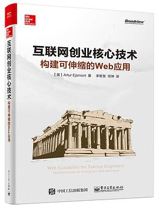
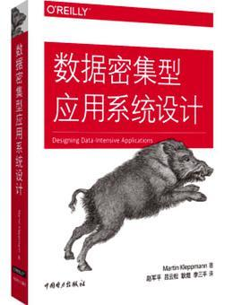
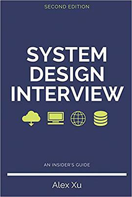

# 2021年程序员跳槽总结+面经+感想

[toc]

一坑未填又开新坑。

LZ4年工作经验，其中硅谷某大公司3年全职。因为2020年万恶之源——美帝大放水，导致2021年就业市场环境各种空前绝后的好。

加上本人LinkedIn上来勾搭的猎头和recruiter实在太多，遂无心准备了一波跳槽。没有面试太多家公司，记录下来整个面试过程。

## 面试准备

其实我在G家干的还是非常满意的，加上绿卡正在排队中，并没有特别想要动的意思，不过人就是不能待在自己的舒适区，不然就会废了，所以未雨绸缪，还是应该面向面试学习一下。

基本上丑国这边的面试就两个方向，做题 + 系统设计。因为上一次面试还是3年前，也是L3的岗位，并没有面过系统设计，所以这次重点放在了系统设计的学习上面。

**刷题：**

经过长时间没有刷题以后，这次打开leetcode我发现基本只会做easy和一些简单的medium题了，所以把leetcode拿出来刷题。

不过还好上一次刷题的功底还在，加上在家工作可以摸鱼划水，所以上班时间可以继续刷题。

刷Leetcode切记不要盲目刷，而是按题型分类的Tag，一类一类的题目刷。刷题不在多贵在精，虽然这次我还是刷了不少的题。

看了一下leetcode，今年面试以来刷了103道简单，142道中等和12道困难。重点当然是中等题，简单题一般来说是实在刷不下去给你找自信的。

**系统设计：**

根据我今年的面试总结，系统设计其实就是扯淡，因为对面面试你的工程师也不可能面面俱到。

准备系统面试我主要看了以下的内容：

入门级别的书：

《Web Scalability for Startup Engineers》[互联网创业核心技术：构建可伸缩的web应用](https://link.zhihu.com/?target=https%3A//book.douban.com/subject/26906846/)

豆瓣链接：

[互联网创业核心技术：构建可伸缩的web应用book.douban.com/subject/26906846/

DDIA，神书，无数人推荐了：DDIA，神书，无数人推荐了的《[数据密集型应用系统设计](https://link.zhihu.com/?target=https%3A//book.douban.com/subject/30329536/)》：

《Designing Data-Intensive Applications》—— Martin Kleppmann

豆瓣链接：

[数据密集型应用系统设计book.douban.com/subject/30329536/

以及系统面试专门的书籍，徐老师的著作：

《System Design Interview – An insider's guide, Second Edition》—— Alex Xu

豆瓣链接：

[System Design Interviewbook.douban.com/subject/35246417/

剩下的时间用来看Grokking the System design interview还有油管上面有很多博主的视频，可以有空都看看。

## 亚马逊

亚马逊是第一个来找我的。应该说，亚马逊就没有不来找我的时候。结果是被亚马逊据了，当时我就感觉很震惊，不过仔细一想确实没有面好。

众所周知，亚马逊的面试最重要的是Behavior Question，所以我大概花了一个周末整理了15到20个场景，然后一一对应亚马逊的leadership principal来准备面试。下面简称LP。

第一轮：Online Assessment，在线做题，秒了。

第二轮：Virtual Onsite，因为疫情，今年所有公司都取消了Onsite，可惜了。之前第一次面亚麻SDE1的时候亚马逊给我定了西雅图市区一晚上300刀的酒店，还每天有75刀的吃饭报销。下面简称VO。

VO1：白人大姐，前面15分钟问LP，然后问了一道题，网页加载速度很慢，因为有很多db call怎么办？答案加cache，所以算法是LRU Cache。

VO2：日裔小哥，前面15分钟LP，算法一道Leetcode前400题里的medium难度DP题，之前刷过忘了，现场又推了一遍状态转移方程。

VO3：印度大哥 + 中国小哥shadow，应该是所谓的bar rasier，但是这个bar也不高，前面20分钟LP。算法2道题，算法是加了各种花里胡哨背景的meeting rooms + merge intervals。

VO4：头巾印度大哥，15分钟问LP，然后是System Design，设计外卖软件(Uber eats)

总的来说的中规中矩，feedback是System design没有达到L5的bar，然后LP有点弱。第一次面system design，确实没面好。

## 某湾区Start Up

和HR聊是预计2022年上半年进行IPO。

## Facebook

还没面，下周面了更新

## Reference

1. [2021年程序员跳槽总结+面经+感想](https://zhuanlan.zhihu.com/p/422322443)