# LeetCode解题过程学习

主要是记录一下整个解题过程的思路，以供日后不断的复习和参考。同时尝试使用英语解释整个过程。

[toc]

## 基础题

### [Two Sum](https://leetcode-cn.com/problems/two-sum/)

Given an array of integers `nums` and an integer `target`, return *indices of the two numbers such that they add up to `target`.*

You may assume that each input would have **exactly one solution**, and you may not use the *same* element twice.

You can return the answer in any order.

```c#
Input: nums = [2,7,11,15], target = 9
Output: [0,1]
Output: Because nums[0] + nums[1] == 9, we return [0, 1].
```

**Constraints:**

- 2 <= nums.length <= 104
- -109 <= nums[i] <= 109
- -109 <= target <= 109
- **Only one valid answer exists.**

**Follow-up**: Can you come up with an algorithm that is less than $O(n2)$ time complexity?


<font size=5> 参考答案 </font>

```c#
public class Solution {
    public int[] TwoSum(int[] nums, int target) {
        Dictionary<int,int> dic =new Dictionary<int,int>();
        for (int i=0;i<nums.Length;i++)
        {
            if(dic.ContainsKey(target-nums[i]))
            {
                return new int[]{dic[target-nums[i]],i};
            }
            dic.Add(nums[i],i);
        }
        return new int[0];
    }
}
```

```c#
Unhandled exception. System.ArgumentException: An item with the same key has already been added. Key: 1 At System.Collections.Generic.Dictionary`2.TryInsert(TKey key, TValue value, InsertionBehavior behavior) Line 10: Solution.TwoSum(Int32[] nums, Int32 target) in Solution.cs Line 35: __Driver__.Main(String[] args) in __Driver__.cs
```

最后执行的输入：

```c#
[1,1,1,1,1,4,1,1,1,1,1,7,1,1,1,1,1] 

11
```


<font size=5> Duplicate keys in .NET dictionaries?</font>

If you're using .NET 3.5, use the [`Lookup`](http://msdn.microsoft.com/en-us/library/bb460184.aspx) class.

EDIT: You generally create a `Lookup` using [`Enumerable.ToLookup`](http://msdn.microsoft.com/en-us/library/system.linq.enumerable.tolookup.aspx). This does assume that you don't need to change it afterwards - but I typically find that's good enough.

If that *doesn't* work for you, I don't think there's anything in the framework which will help - and using the dictionary is as good as it gets :(

<font size=6>What is the difference between LINQ ToDictionary and ToLookup</font>

A dictionary is a 1:1 map (each key is mapped to a single value), and a dictionary is mutable (editable) after the fact.

A lookup is a 1:many map (multi-map; each key is mapped to an `IEnumerable<>` of the values with that key), and there is no mutate on the `ILookup<,>` interface.

As a side note, you can query a lookup (via the indexer) on a key that doesn't exist, and you'll get an empty sequence. Do the same with a dictionary and you'll get an exception.

So: how many records share each key?

An overly simplified way of looking at it is that a `Lookup<TKey,TValue>` is *roughly comparable* to a `Dictionary<TKey,IEnumerable<TValue>>`


Two significant differences:

- `Lookup` is immutable. Yay :) (At least, I believe the concrete `Lookup` class is immutable, and the `ILookup` interface doesn't provide any mutating members. There *could* be other mutable implementations, of course.)
- When you lookup a key which isn't present in a lookup, you get an empty sequence back instead of a `KeyNotFoundException`. (Hence there's no `TryGetValue`, AFAICR.)

They're likely to be equivalent in efficiency - the lookup may well use a `Dictionary<TKey, GroupingImplementation<TValue>>` behind the scenes, for example. Choose between them based on your requirements. Personally I find that the lookup is usually a better fit than a `Dictionary<TKey, List<TValue>>`, mostly due to the first two points above.

Note that as an implementation detail, the concrete implementation of `IGrouping<,>` which is used for the values implements `IList<TValue>`, which means that it's efficient to use with `Count()`, `ElementAt()` etc.


A [Lookup](https://docs.microsoft.com/en-us/dotnet/api/system.linq.lookup-2?view=net-6.0) resembles a [Dictionary](https://docs.microsoft.com/en-us/dotnet/api/system.collections.generic.dictionary-2?view=net-6.0). The difference is that a [Dictionary](https://docs.microsoft.com/en-us/dotnet/api/system.collections.generic.dictionary-2?view=net-6.0) maps keys to single values, whereas a [Lookup](https://docs.microsoft.com/en-us/dotnet/api/system.linq.lookup-2?view=net-6.0) maps keys to collections of values.

You can create an instance of a [Lookup](https://docs.microsoft.com/en-us/dotnet/api/system.linq.lookup-2?view=net-6.0) by calling [ToLookup](https://docs.microsoft.com/en-us/dotnet/api/system.linq.enumerable.tolookup?view=net-6.0) on an object that implements [IEnumerable](https://docs.microsoft.com/en-us/dotnet/api/system.collections.generic.ienumerable-1?view=net-6.0).


> Lookup<TKey, TElement>不能像一般的字典那样创建，而必须调用方法ToLookup()，它返回一个Lookup<TKey, TElement>对象。方法ToLookup()是一个扩展方法，可以用于实现了IEnumerable<T>的所有类。


**Reference:**

1. [Duplicate keys in .NET dictionaries?](https://stackoverflow.com/questions/146204/duplicate-keys-in-net-dictionaries)

2. [What is the difference between LINQ ToDictionary and ToLookup](https://stackoverflow.com/questions/5659066/what-is-the-difference-between-linq-todictionary-and-tolookup)

3. [Difference between Lookup() and Dictionary(Of list())](https://stackoverflow.com/questions/13362490/difference-between-lookup-and-dictionaryof-list)

4. [Lookup<TKey,TElement> Class--MSDN](https://docs.microsoft.com/en-us/dotnet/api/system.linq.lookup-2?redirectedfrom=MSDN&view=net-6.0)

   


研究了半天的Lookup和Dictionary区别，最后发现只要加个这样的判断，厚礼蟹：

```C#
public class Solution {
    public int[] TwoSum(int[] nums, int target) {
        Dictionary<int,int> dic =new Dictionary<int,int>();
        for (int i=0;i<nums.Length;i++)
        {
            if(dic.ContainsKey(target-nums[i]))
            {
                return new int[]{dic[target-nums[i]],i};
            }
            if(!dic.ContainsKey(nums[i])) //去重判断
            {
                dic.Add(nums[i],i);
            }
           
        }
        return new int[0];
    }
}
```


## 日历(模拟)


### 1154. [Day of the Year](https://leetcode-cn.com/problems/day-of-the-year/)

Given a string `date` representing a [Gregorian calendar](https://en.wikipedia.org/wiki/Gregorian_calendar) date formatted as `YYYY-MM-DD`, return the day number of the year.

**Example 1:**

```c#
Input: date = "2019-01-09"
Output: 9
Explanation: Given date is the 9th day of the year in 2019.
```


<font size=5>**方法一：直接计算** </font>

我们首先从给定的字符串 `date` 中提取出年 `year`，月 `month` 以及日 `day`。

这样一来，我们就可以首先统计到  `month` 的前一个月为止的天数。这一部分只需要使用一个长度为 $12$ 的数组，预先记录每一个月的天数，再进行累加即可。随后我们将答案再加上 `day`，就可以得到  `date` 是一年中的第几天。

需要注意的是，如果  `year` 是闰年，那么二月份会多出一天。闰年的判定方法为：`year` 是 $400$ 的倍数，或者 `year` 是 $4$ 的倍数且不是 $100$ 的倍数。

```c#
public class Solution{
    public int DayOfYear(string date){ //2022-01-03
        int year = int.Parse(date.Substring(0,4));
        int month = int.Parse(date.Substring(5,2));//要从第5个字符开始截取，因为第4个字符是：-
        int day = int.Parse(date.Substring(8));
        
        int[] amount = {31, 28, 31, 30, 31, 30, 31, 31, 30, 31, 30, 31};
        if(year % 400 ==0 ||(year % 4 == 0 || year % 100 != 0)){
            ++amount[1];
        }
        
        int ans = 0;
        for(int i = 0; i < mmonth -1 ;i++){
            ans += amount[i];
        }
        return ans + day;
    }
}
```


<font size = 5>**复杂度分析**</font>

- 时间复杂度：$ O(1)$。我们将字符串的长度（定值 7）以及一年的月份数 12 视为常数。
- 空间复杂度：$ O(1)$。


### 1185. [Day of the Week](https://leetcode-cn.com/problems/day-of-the-week/)

Given a date, return the corresponding day of the week for the date. 

The input is given as three integers representing the `day`, `month` and `year` respectively.

Return the answer as one of the following values `{"Sunday", "Monday", "Tuesday", "Wednesday", "Thursday", "Friday", "Saturday"}`


**Example 1:**

```c#
Input: day = 31, month = 8, year = 2019
Output: "Saturday"
```


**Constraints:**

- The given dates are valid dates between the years `1971` and `2100`.


<font size=5> 模拟 </font>

题目保证日期是在 `1971`到 `2100`之间，我们可以计算给定日期距离 `1970`年的最后一天（星期四）间隔了多少天，从而得知给定日期是周几。

具体的，可以先通过循环处理计算***年份*** 在[1971, year - 1]时间段，经过了多少天（注意平年为365天，闰年为366）；

然后再处理当前年份`year`的月份在[1, month - 1]时间段，经过了多少天（注意当年是否为闰年，以特殊处理 $2$ 月份）；

最后计算当月 `month`经过了多少天，即再增加 `day`天。

得到距离 `1970`的最后一天（星期四）的天数后，进行 ***模拟***，即可映射回答案。


<font size=5> 代码参考 </font>

```C#
public class Solution {
    static string[] weeks = new string[]{"Sunday", "Monday", "Tuesday", "Wednesday", "Thursday", "Friday", "Saturday"};
    static int[] days = new int[]{31, 28, 31, 30, 31, 30, 31, 31, 30, 31, 30, 31};
    
    public string DayOfTheWeek(int day, int month, int year) {
       
        int ans = 4;// 1970-12-31是星期四， 那么 1971-1-1是星期五，也就是 ans + 1;
        
        for(int i = 1971; i < year; i++){//注意下标是从1971开始而不是0开始
            bool isLeap = (i % 400 == 0 || (i % 4 == 0 && i % 100 != 0));
            ans += isLeap ? 366 : 365;
        }

        for (int i = 1; i < month ; i++){
           /* Console.WriteLine(i);
            注意这里是要拿 传递进来的 year 进行闰年的判断，而不是拿 i....
            if(i==2 && (i % 400 == 0 || (i % 4 == 0 && i % 100 !=0))){
                ans++;
            }*/
            ans += days[i - 1]; ans += days[i - 1];// i=0,则 days[-1]数组越界
            if (i == 2 && ((year % 4 == 0 && year % 100 != 0) || year % 400 == 0)) ans++;
        }
        ans += day;
        //Console.WriteLine(ans);
        return weeks[ans % 7];
    }
}
```


## 数学题

### [507. Perfect Number](https://leetcode-cn.com/problems/perfect-number/)

A [perfect number](https://en.wikipedia.org/wiki/Perfect_number) is a **positive integer** that is equal to the sum of its **positive divisors**, excluding the number itself. A **divisor** of an integer `x` is an integer that can divide `x` evenly.

Given an integer `n`, return `true` if `n` is a perfect number, otherwise return `false`.


**Example 1:**

```c#
Input: num = 28
Output: true
Explanation: 28 = 1 + 2 + 4 + 7 + 14
1, 2, 4, 7, and 14 are all divisors of 28.
```


#### 方法一：枚举

我们可以枚举  `num` 的所有真因子，累加所有真因子之和，记作 `sum`。若 $sum=num$ 则返回 `true`，否则返回 `false`。

在枚举时，我们只需要枚举不超过  $\sqrt{num}$ 的数。这是因为如果 `num` 有一个大于$\sqrt{num}$ 的因数 `d`, 那么它一定有一个小于 $\sqrt{num}$ 的因数 $\frac{num}{n}$ 。

在枚举时，若找到了一个因数`d`, 那么就找到了因数$\frac{num}{d}$ 。 注意当 $d * d = num$ 时这两个因数相同，此时不能重复计算。


<font size=5> 参考代码 </font>

```c#
public class Solution {
    public bool CheckPerfectNumber(int num) {
        if(num==1){
            return false;
        }
        int sum = 1;
        
        for(int d = 2; d * d <= num; d++){
            if(num % d == 0){
                Console.WriteLine(d);
                sum += d;// 2,4 都在这里执行
                if(d*d<num){ //真是令人大开眼界
                    Console.WriteLine("num /d= "+num /d);
                    sum += num /d; //14 （num/2）,7(num/4)都在这里执行
                }              
            }
        }
        Console.WriteLine("Sum:"+sum);
        Console.WriteLine("num:"+num);
        return  sum == num; 
    }
}
```


## Array

### [C# array initialization](https://www.tutorialspoint.com/csharp/csharp_arrays.htm)

An array stores a **fixed-size sequential collection** of elements of the same type.

Declaring an array does not initialize the array in the memory. When the array variable is initialized, you can assign values to the array.

Array is a reference type, so you need to use the **new** keyword to create an instance of the array. For example,

```C#
double[] balance = new double[10];
```


You can assign values to the array **at the time of declaration**, as shown −

```C#
double[] balance = {2340.0, 4523.69, 3421.0};
```


You can also **create and initialize** an array, as shown −

```C#
int[] marks = new int[5]{99,  98, 92, 97, 95};
```


You may also **omit** the size of the array, as shown −

```c#
int[] marks = new [] {99,  98, 92, 97, 95};
```


### [747. Largest Number At Least Twice of Others](https://leetcode-cn.com/problems/largest-number-at-least-twice-of-others/)


You are given an integer array `nums` where the largest integer is **unique**.

Determine whether the largest element in the array is **at least twice** as much as every other number in the array. If it is, return *the **index** of the largest element, or return* `-1` *otherwise*.

 **Example 1:**

```c#
Input: nums = [3,6,1,0]
Output: 1
Explanation: 6 is the largest integer.
For every other number in the array x, 6 is at least twice as big as x.
The index of value 6 is 1, so we return 1.
```

**Example 2:**

```c#
Input: nums = [1,2,3,4]
Output: -1
Explanation: 4 is less than twice the value of 3, so we return -1.
```

**Example 3:**

```c#
Input: nums = [1]
Output: 0
Explanation: 1 is trivially at least twice the value as any other number because there are no other numbers.
```


<font size = 5> 我的代码 </font>

```C#
public class Solution {
    public int DominantIndex(int[] nums) {
        int len = nums.Length;
        if(len <=1){
            return 0;
        }
        //var newArr = nums;使用这种方法传值，sort之后num也会跟着被排序{0，1,3,6}
        var newArr = new int[len];
        nums.CopyTo(newArr,0);
        Array.Sort(newArr);
        Console.WriteLine(string.Join("\n",nums));
        if(newArr[len-1] >= newArr[len-2]*2 ){
            for(int i = 0; i < len; i++){
                if(nums[i] ==newArr[len-1]){
                   return i; 
                }
            }
        }
        return -1;  
    }
}
```


- 数值如果直接用=赋值，会发生值类型的改变，也就是一个地方发生的元素发生改变，另一个地方也随之变动；
- 这时候需要使用array.CopyTo进行赋值。这牵涉到了**深拷贝**和**浅拷贝** ，需要到StackOverflow进一步学习；
- 相比官方提供的[答案](https://leetcode-cn.com/problems/largest-number-at-least-twice-of-others/solution/zhi-shao-shi-qi-ta-shu-zi-liang-bei-de-z-985m/)，我这种写法时间是 O(n<sup>2</sup>logn);因此还需要进一步打磨； 


## Simulation 


### [1716. Calculate Money in Leetcode Bank](https://leetcode-cn.com/problems/calculate-money-in-leetcode-bank/)

Hercy wants to save money for his first car. He puts money in the Leetcode bank **every day**.

He starts by putting in \$1 on Monday, the first day. Every day from Tuesday to Sunday, he will put in \$1 more than the day before. On every **subsequent** Monday, he will put in $1 more than the **previous Monday**.

Given `n`, return the total amount of money he will have in the Leetcode bank at the end of the **n<sup>th</sup>** day.


**Example 2:**

```c#
Input: n = 10
Output: 37
Explanation: After the 10th day, the total is (1 + 2 + 3 + 4 + 5 + 6 + 7) + (2 + 3 + 4) = 37. Notice that on the 2nd Monday, Hercy only puts in $2.
```


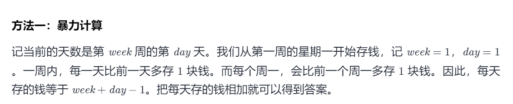 


## Matrix

### [2022. Convert 1D Array Into 2D Array](https://leetcode-cn.com/problems/convert-1d-array-into-2d-array/)  

You are given a **0-indexed** 1-dimensional (1D) integer array `original`, and two integers, `m` and `n`. You are tasked with creating a 2-dimensional (2D) array with `m` rows and `n` columns using **all** the elements from `original`.

The elements from indices `0` to `n - 1` (**inclusive**) of `original` should form the first row of the constructed 2D array, the elements from indices `n` to `2 * n - 1` (**inclusive**) should form the second row of the constructed 2D array, and so on.

Return an `m x n` 2D array constructed according to the above procedure, or an empty 2D array if it is impossible.

 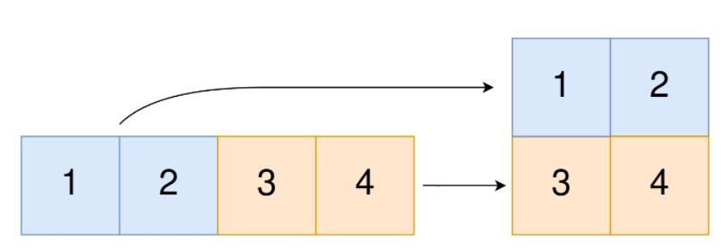


**Example:**

```c#
Input: original = [1,2,3,4], m = 2, n = 2
Output: [[1,2],[3,4]]
Explanation: The constructed 2D array should contain 2 rows and 2 columns.
The first group of n=2 elements in original, [1,2], becomes the first row in the constructed 2D array.
The second group of n=2 elements in original, [3,4], becomes the second row in the constructed 2D array.

```


**Example2:**

```c#
Input: original = [1,2,3], m = 1, n = 3
Output: [[1,2,3]]
Explanation: The constructed 2D array should contain 1 row and 3 columns.
Put all three elements in original into the first row of the constructed 2D array.
```


Tips:

1. When is it possible to convert original into a 2D array and when is it impossible?
2. It is possible if and only if m * n == original.length
3. If it is possible to convert original to a 2D array, keep an index i such that original[i] is the next element to add to the 2D array.


#### 二维数组常识: x轴 = row; y 轴 = column

新建一个二位数值

```c#
int[][] ans = new int[m][];//定义一个 m(=2) 维的数组, 即指定 y 轴 (column) 为 m;
如果定义一个三维数组，则 int[][] ans = new int[3][];//? 待验证
```

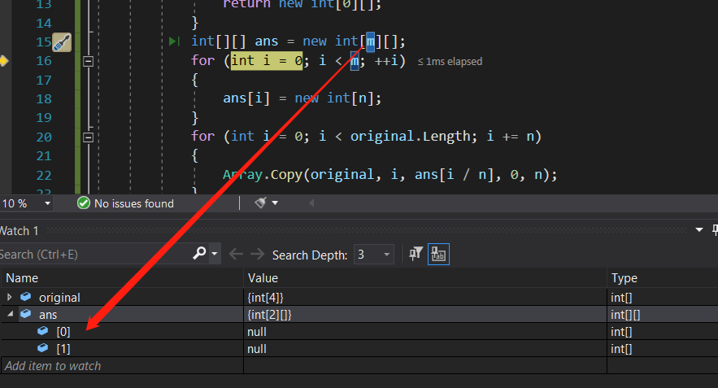 


The following example assigns a value to a particular array element.

```csharp
array5[2, 1] = 25;
```


Similarly, the following example gets the value of a particular array element and assigns it to variable `elementValue`.

```csharp
int elementValue = array5[2, 1];
```


The following code example initializes the array elements to default values (except for jagged arrays).

```csharp
int[,] array6 = new int[10, 10];
```

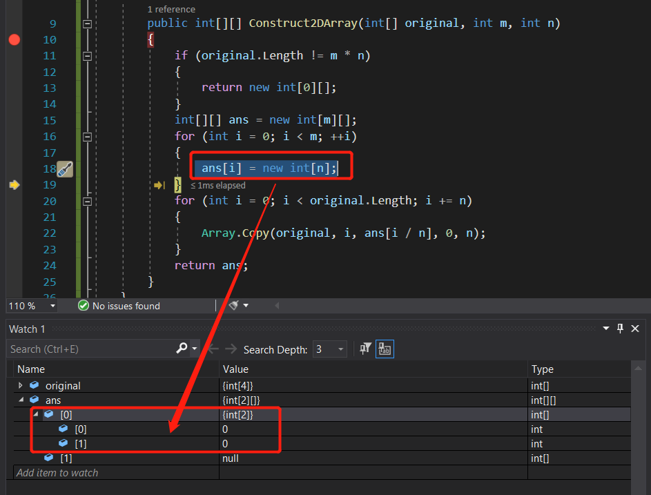 

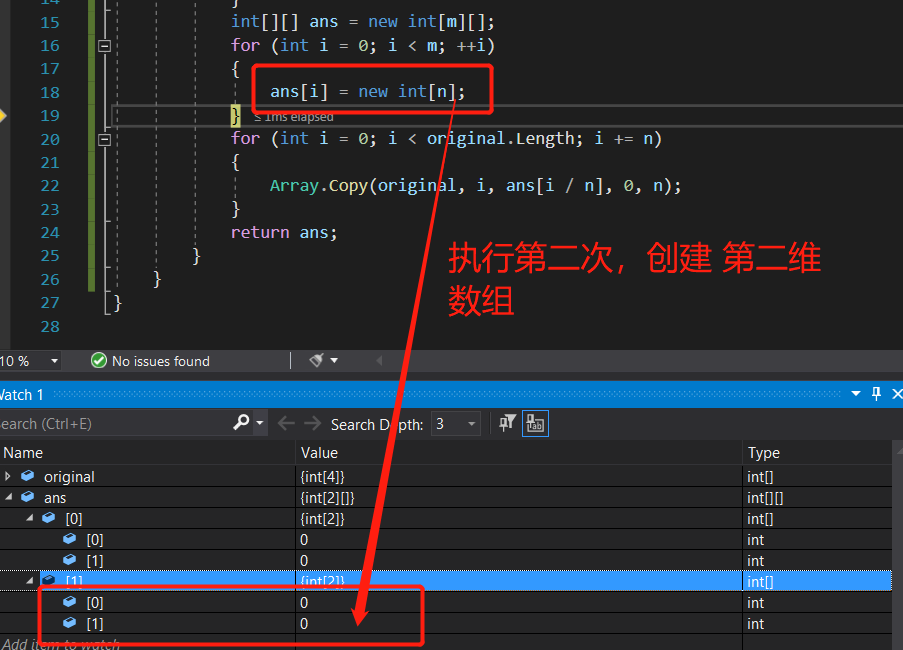 


### Jagged array v.s Multidimensional array

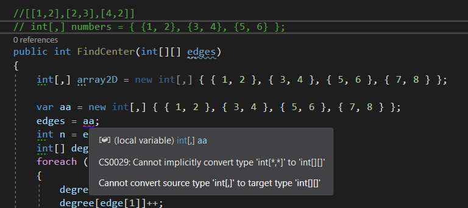 

> The whole point of a jagged array is that the "nested" arrays needn't be of uniform size

1. What is the difference between jagged array and Multidimensional array. Is there a benefit of one on another?

2. And why would the Visual Studio not allow me to do a

   ```c#
   MyClass[][] abc = new MyClass[10][20];
   ```

   (We used to do that in C++, but in C# it underlines [20] with red wriggly line.. Says invalid rank specifier)

   but is happy with

   ```c#
   MyClass[,] abc = new MyClass[10,20];
   ```

3. Finally how can I initialize this in a single line (like we do in simple array with `{new xxx...}{new xxx....}`)

   ```c#
   MyClass[][,][,] itemscollection;
   ```


**回答**：

1. A jagged array is an array-of-arrays, so an `int[][]` is an array of `int[]`, each of which can be of different lengths and occupy their own block in memory. A multidimensional array (`int[,]`) is a single block of memory (essentially a matrix).

   > 锯齿状数组是 ***数组的数组***，因此，`int[][]`是`int[]`的数组，每个数组可以有不同的长度，并在内存中占据各自的块。多维数组（`int[，]`）是单个内存块（本质上是一个矩阵）

2. You can't create a `MyClass[10][20]` because each sub-array has to be initialized separately, as they are separate objects:

   > 无法创建“MyClass\[10][20]”，因为每个子数组都必须单独初始化，因为它们是单独的对象：

   ```cs
   MyClass[][] abc = new MyClass[10][];
   
   for (int i=0; i<abc.Length; i++) {
       abc[i] = new MyClass[20];
   }
   ```

   A `MyClass[10,20]` is ok, because it is initializing a single object as a matrix with 10 rows and 20 columns.

   > “MyClass[10,20]”是可以的，因为它将单个对象初始化为10行20列的矩阵。

3. A `MyClass[][,][,]` can be initialized like so (not compile tested though):

   ```cs
   MyClass[][,][,] abc = new MyClass[10][,][,];
   
   for (int i=0; i<abc.Length; i++) {
       abc[i] = new MyClass[20,30][,];
   
       for (int j=0; j<abc[i].GetLength(0); j++) {
           for (int k=0; k<abc[i].GetLength(1); k++) {
               abc[i][j,k] = new MyClass[40,50];
           }
       }
   }
   ```

Bear in mind, that the CLR is heavily optimized for single-dimension array access, so using a jagged array will likely be faster than a multidimensional array of the same size.

> 请记住，CLR针对一维数组访问进行了大量优化，因此使用交错数组可能比使用相同大小的多维数组更快。


-  A jagged array (`int[][]`): it is an array of arrays. The child array at `arr[0]` can be a different length to the array at `arr[1]`.
- A 2d array. The dimensions are ***pre-defined*** and the length of ***the second bound never changes*** based on the first.


**Reference:**

- [Why we have both jagged array and multidimensional array?](https://stackoverflow.com/questions/4648914/why-we-have-both-jagged-array-and-multidimensional-array)
- [Argument 1: Cannot convert from 'int[\][]' to 'int[*,*]' [duplicate]](https://stackoverflow.com/questions/57346143/argument-1-cannot-convert-from-int-to-int)


<font size =5> **Array.Copy Method 描述** </font>

[Array.Copy Method](https://docs.microsoft.com/en-us/dotnet/api/system.array.copy?view=net-6.0#System_Array_Copy_System_Array_System_Int32_System_Array_System_Int32_System_Int32_)

Copies a range of elements in one [Array](https://docs.microsoft.com/en-us/dotnet/api/system.array?view=net-6.0) to another [Array](https://docs.microsoft.com/en-us/dotnet/api/system.array?view=net-6.0) and performs type casting and boxing as required.


**Copy(Array, Int32, Array, Int32, Int32)**:

Copies a range of elements from an [Array](https://docs.microsoft.com/en-us/dotnet/api/system.array?view=net-6.0) starting at the specified source index and pastes them to another [Array](https://docs.microsoft.com/en-us/dotnet/api/system.array?view=net-6.0) starting at the specified destination index. The length and the indexes are specified as 64-bit integers.

**Parameters Desc:**

1. **sourceArray**: The Array that contains the data to copy.
 1. **sourceIndex**: A 32-bit integer that represents the index in the sourceArray at which copying begins.
 1. **destinationArray**: The Array that receives the data.
 1. **destinationIndex**: A 32-bit integer that represents the index in the destinationArray at which storing begins.
 1. **length**: A 32-bit integer that represents the number of elements to copy.


**这题的核心是通过Array.Copy把Original的数组，按照一定起始值，分别拷贝到 ans[0]和  ans[1] 中**。由于对二维数组的拷贝以及改方法的完全没有接触，导致看答案都看不懂，只能打开Visual Studio直接开撸debugger.


<font size =5>**Array.Copy(original, i, ans[i / n], 0, n);** </font>

**第一次循环：**

```c#
// original = [1,2,3,4], m = 2, n = 2

int[][] ans = new int[m][];

for (int i = 0; i < m; ++i)
{
    ans[i] = new int[n];
}

Array.Copy(original, 0, ans[0 / 2], 0, 2);
=>
Arrary.Copy(original,0,ans[0],0,2)
```

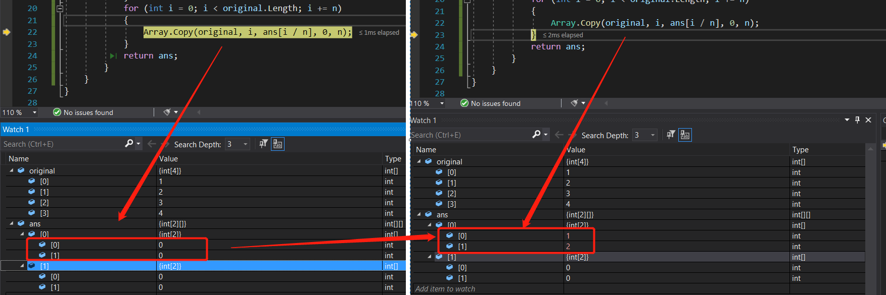


**第二次循环：**

```c#
// original = [1,2,3,4], m = 2, n = 2

int[][] ans = new int[m][];

for (int i = 0; i < m; ++i)
{
    ans[i] = new int[n];
}

Array.Copy(original, 2, ans[2 / 2], 0, 2);
 =>
Array.Copy(original,2,ans[1],0,2);
```

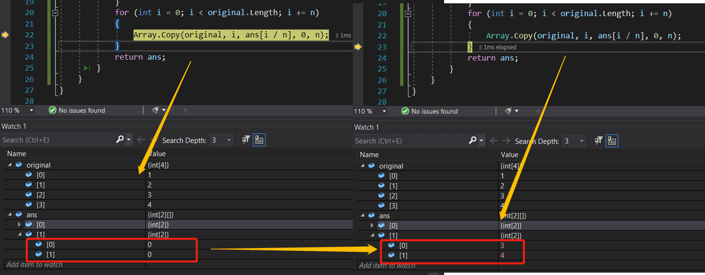


如果是一维数组的情况：

```c#
  // original = [1,2,3], m = 1, n = 3
  /*
  第一次i=0； 
  第二次i= i+n = 0+3 = 3,则 3 < 3 为 false,跳出 for 循环
  */
  for (int i = 0; i < original.Length; i += n)
  {
  		Array.Copy(original, i, ans[i / n], 0, n);
  }
```


<font size=5>方法一：模拟 </font>
设 `original` 的长度为 `k`，根据题意，如果 $k\ne mnk$  则无法构成二维数组，此时返回空数组。否则我们可以遍历 `original`，每 `n` 个元素创建一个一维数组，放入二维数组中。


<font size =5> 参考代码 </font>

```c#
public class Solution {
    public int[][] Construct2DArray(int[] original, int m, int n) {
        if(original.Length != m*n){
            return new int [0][];
        }

        int[][] ans = new int [m][];//定义一个 m 维的数组, 即指定 y 轴 (column) 为 m;
        for (int i = 0; i < m; i++){
            /*
                分别定义 m(=2)维数组 的 x 轴 (row) 的大小：
                x 都为 n；
            */
            ans[i] = new int[n];
        }
        for (int i = 0; i< original.Length; i += n){
            /*
            Parameters Desc:
            1): sourceArray:The Array that contains the data to copy.
            2): sourceIndex: A 32-bit integer that represents the index in the sourceArray at which copying begins.
            3):destinationArray:The Array that receives the data.
            4):destinationIndex: A 32-bit integer that represents the index in the destinationArray at which storing begins.
            5):length:A 32-bit integer that represents the number of elements to copy.
            */
            Array.Copy(original, i, ans[i/n],0,n);
        }
        return ans;
    }
}
```

**Reference:**

1. [Multidimensional Arrays (C# Programming Guide)](https://docs.microsoft.com/en-us/dotnet/csharp/programming-guide/arrays/multidimensional-arrays)


## 图 Graph


### [1791. Find Center of Star Graph](https://leetcode-cn.com/problems/find-center-of-star-graph/)

There is an undirected **start** graph consisting of  `n`  nodes labeled from `1` to `n`. A star graph is a graph where there is one **center** node and **exactly** `n-1` edges that connected the center node with every other node.

You are given a 2D integer array `edges` where each edges **[i] = [u<sub>i</sub>,v<sub>i</sub>]**. indicates that there is an edge between the nodes u<sub>i</sub> and v<sub>i</sub> . Return the center of the given star graph. 

**Example 1:**

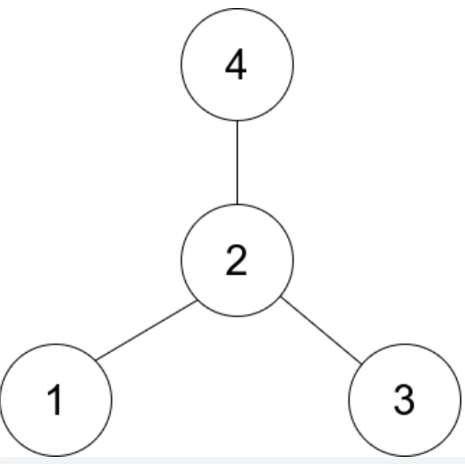 


```c#
Input: edges = [[1,2],[2,3],[4,2]]
Output: 2
Explanation: As shown in the figure above, node 2 is connected to every other node, so 2 is the center.
```

**Example 2:**

```c#
Input: edges = [[1,2],[5,1],[1,3],[1,4]]
Output: 1
```


**Tips:**

- The center is the only node that has more than one edge.
- The center is also connected to all other nodes.
- Any two edges must have a common node, which is the center.


#### 方法一：计算每个节点的度

由 `n` 个节点组成的星型图中，有一个中心节点，有 `n−1` 条边分别连接中心节点和其余的每个节点。因此，中心节点的度是`n−1`，其余每个节点的度都是 `1`。

> 一个节点的**度**的含义是与**该节点相连的边数**。

遍历 *edges* 中的每条边并计算每个节点的度，度为 *n−1* 的节点即为中心节点。


```c#
public class Solution{
    public int FindCenter(int[][] edges){
        int n = edges.Lenght + 1; //要加1 ，否则会数组越界
        int[] degrees = new int[n + 1];
        foreach(int[] edge in edges){
            degrees[edges[0]]++;
            degrees[edges[1]]++;
        }
        for(int i=0; ; i++){
            if(degree[i] == n-1){
                return i;
            }
        }
    }
}
```


**自测代码：**

```C#
    public int FindCenter()
    {
        int[][] edges = new int[3][];
        edges[0] = new int[] { 1, 2 };
        edges[1] = new int[] { 2, 3 };
        edges[2] = new int[] { 4, 2 };

        int n = edges.Length + 1;
        int[] degree = new int[n + 1];
        foreach (var edge in edges)
        {
            degree[edge[0]]++;
            degree[edge[1]]++;
        }
        for (int i = 0; ; i++)
        {
            if (degree[i] == n - 1)
            {
                return i;
            }
        }
    }
```

-  这里难点是如何构建Jagged Array数组。查了[StatckOverflow](https://stackoverflow.com/questions/4648914/why-we-have-both-jagged-array-and-multidimensional-array),花了下一下才大概搞懂jagged array和multi-dimensional array的差别。
- 一开始始终无法理解为什么是 **edge[0]**和**edge[1]**；直接debugger进行才知道 **`edges`**被 `foreach` 之后，里面的每项 item 都是两两构成的一个数组，也就是题目里提到的 **[u<sub>i</sub>,v<sub>i</sub>]**.
- 今日这题的简单题用去了我一个下午 2022年2月18日17:41:21


 **Round 1:** 

```c#
edge[0] = 1
edge[1] = 2

    degree[1]++
    degree[2]++
```

**Round 2:** 

```c#
edge[0] = 2
edge[1] = 3

    degree[2]++
    degree[3]++
```

**Round 3:** 

```C#
edge[0] = 4
edge[1] = 2

    degree[4]++
    degree[2]++
```


## 哈希表 hash 

### [13. Roman to Integer](https://leetcode-cn.com/problems/roman-to-integer/)

Roman numerals are represented by seven different symbols: `I`, `V`, `X`, `L`, `C`, `D` and `M`.

| Symbol | Value |
| ------ | ----- |
| I      | 1     |
| V      | 5     |
| X      | 10    |
| L      | 50    |
| C      | 100   |
| D      | 500   |
| M      | 1000  |

For example, `2` is written as `II` in Roman numeral, just two one's added together. `12` is written as `XII`, which is simply `X + II`. The number `27` is written as `XXVII`, which is `XX + V + II`.

Roman numerals are usually written largest to smallest from left to right. However, the numeral for four is not `IIII`. Instead, the number four is written as `IV`. Because the one is before the five we subtract it making four. The same principle applies to the number nine, which is written as `IX`.  There are six instances where subtraction is used:

- `I` can be placed before `V` (5) and `X` (10) to make 4 and 9. 
- `X` can be placed before `L` (50) and `C` (100) to make 40 and 90. 
- `C` can be placed before `D` (500) and `M` (1000) to make 400 and 900.

Given a roman numeral, convert it to an integer.

**Example 2:**

```c#
Input: s = "LVIII"
Output: 58
Explanation: L = 50, V= 5, III = 3.
```

**Example 3:**

```C#
Input: s = "MCMXCIV"
Output: 1994
Explanation: M = 1000, CM = 900, XC = 90 and IV = 4.
```

**Constraints:**

- `s` contains only the characters `('I', 'V', 'X', 'L', 'C', 'D', 'M')`.
- It is **guaranteed** that `s` is a valid roman numeral in the range `[1, 3999]`.


<font size=5> 参考 </font>

建立一个`HashMap`(C#是`Dictionary`)来映射符号和值，然后对字符串从左到右来，如果当前字符代表的值不小于其右边，就加上该值；否则就减去该值。以此类推到最左边的数，最终得到的结果即是答案。


<font size=5> 参考代码 </font>

```C#
public class Solution {
    public int RomanToInt(string s) {
      var dic = new Dictionary<char,int>{
        {'I',1},
        {'V',5},
        {'X',10},
        {'L',50},
        {'C',100},
        {'D',500},
        {'M',1000}
      };
    
     int ans = 0;
     for (int i = 0; i<s.Length;i++){
         int numbers = dic[s[i]];
         if(i<s.Length-1 && numbers < dic[s[i+1]])
         {
             ans = ans - numbers;
         }
         else
         {
             ans = ans +numbers;
         }
     }
     return ans;
    }
}
```


### [884. Uncommon Words from Two Sentences](https://leetcode-cn.com/problems/uncommon-words-from-two-sentences/)

A **sentence** is a string of single-space separated words where each word consists only of lowercase letters.

A word is **uncommon** if it appears exactly once in one of the sentences, and **does not appear** in the other sentence.

Given two **sentences** `s1` and `s2`, return a list of all the **uncommon words**. You may return the answer in **any order**.

 

Example 1:

```c#
Input: s1 = "this apple is sweet", s2 = "this apple is sour"
Output: ["sweet","sour"]
```

Example 2:

```c#
Input: s1 = "apple apple", s2 = "banana"
Output: ["banana"]
```


一开始审题不认真，以为只要取两个集合的**差集**就好了：

```C#
public class Solution {
    public string[] UncommonFromSentences(string s1, string s2) {
        string[] word1 = s1.Split(' ');
        string[] word2 = s2.Split(' ');
        var list1 = new List<string>();
        var list2 = new List<string>();
        foreach(var item in word1)
        {
            if(!list1.Contains(item)){
                list1.Add(item);
            }
        }

        foreach(var item in word2){
            if(!list2.Contains(item)){
                list2.Add(item);
            }
        }

        var list3 = list2.Except(list1);
        return list3.ToArray();
    }
}
```

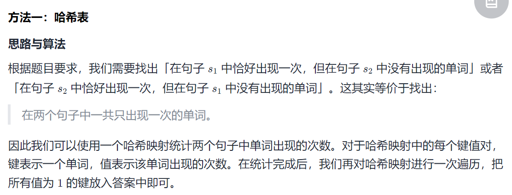 


<font size = 5> 参考代码 </font>

```C#
public class Solution {
    public string[] UncommonFromSentences(string s1, string s2) {
        Dictionary<string,int> dic = new Dictionary<string,int>();
        InsertDic(s1,dic);
        InsertDic(s2,dic);

        var ans = new List<string>();
        foreach(KeyValuePair<string,int> pair in dic){
            if(pair.Value ==1){
                ans.Add(pair.Key);
            }
        }
        return ans.ToArray();
    }

    private void InsertDic(string s, Dictionary<string,int> dic){
        var arr = s.Split(' ');
        foreach(var item in arr){
            if(!dic.ContainsKey(item)){
                dic.Add(item,0);
            }
            dic[item]++;
        }
    }
}
```

**KeyValuePair 和 Dictionary 的关系**

- **KeyValuePair** 
  - **KeyValuePair** 是一个结构体（struct）；
  - **KeyValuePair** 只包含一个Key、Value的键值对。
- **Dictionary** 
      -  **Dictionary** 可以简单的看作是KeyValuePair 的集合；
      -  **Dictionary** 可以包含多个Key、Value的键值对。


#### C#下的HashTable ++效果

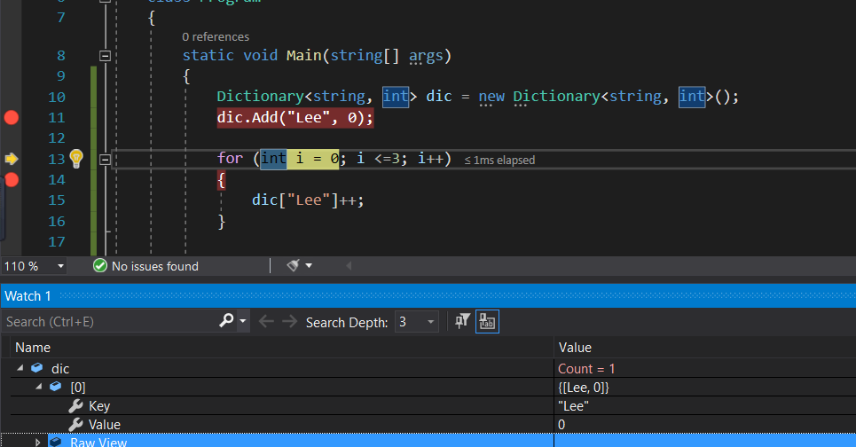 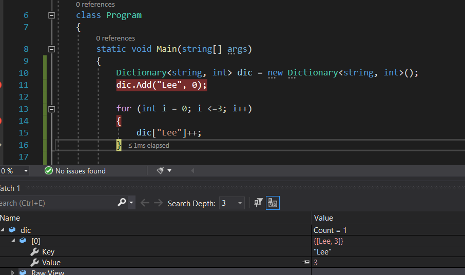


### 1178. [Sum of Unique Elements](https://leetcode-cn.com/problems/sum-of-unique-elements/)

You are given an integer array `nums`. The unique elements of an array are the elements that appear **exactly once** in the array.

Return *the **sum** of all the unique elements of* `num`.

**Example 1:**

```c#
Input: nums = [1,2,3,2]
Output: 4
Explanation: The unique elements are [1,3], and the sum is 4.
```


**Code**

```C#
public class Solution {
    public int SumOfUnique(int[] nums) {
        //var arrNums = nums.Split(',');
        var dic = new Dictionary<int,int>();
        foreach(var item in nums){
            if(!dic.ContainsKey(item)){
                //dic.Add(item,1);
                dic.Add(item,0);
            }
            dic[item]++;
        }
        int ans = 0;
        foreach(KeyValuePair<int,int> pair in dic){
            if(pair.Value == 1){
                ans += pair.Key;
            }
        }
        return ans;
    }
}
```


## 字符串题


### [1576. Replace All ?'s to Avoid Consecutive Repeating Characters](https://leetcode-cn.com/problems/replace-all-s-to-avoid-consecutive-repeating-characters/)

Given a string `s` containing only lowercase English letters and the `'?'` character, convert all the `'?'` characters into lowercase letters such that the final string does not contain any **consecutive repeating** characters. You **cannot** modify the non `'?'` characters.

It is **guaranteed** that there are no consecutive repeating characters in the given string **except** for `'?'`.

*Return the final string after all the conversions (possibly zero) have been made*. If there is more than one solution, return **any of them**. It can be shown that an answer is always possible with the given constraints.


**Example 1:**

```c#
Input: s = "?zs"
Output: "azs"
Explanation: There are 25 solutions for this problem. From "azs" to "yzs", all are valid. Only "z" is an invalid modification as the string will consist of consecutive repeating characters in "zzs".
```


**Example 2:**

```c#
Input: s = "ubv?w"
Output: "ubvaw"
Explanation: There are 24 solutions for this problem. Only "v" and "w" are invalid modifications as the strings will consist of consecutive repeating characters in "ubvvw" and "ubvww".
```


<font size=5> 参考代码 </font>

```c#
public class Solution {
    public string ModifyString(string s) {
        int len = s.Length-1;
        char[] arrS = s.ToArray();

        for(int i = 0; i < len; i ++){
            if(arrS[i] == '?'){
                for (char ch = 'a'; ch <= 'c'; ch++){
                    if( (i > 0 && arrS[i-1] == ch) || (i < len - 1 && arrS[i+1] == ch)){
                        continue;
                    }
                    arrS[i] = ch;
                    break;// break a-c的循环
                }
            }
        }
        return new string(arrS);
    }
}
```

- 输入**`"j?qg??b"`**， 输出 **`"jaqgabb"`** 预期结果  **`"jaqgacb"`**
- 问题可能出在 ` int len = s.Length-1;`，减1，而在判断是否等于ch的时候，又减去1
- 去掉 `-1` 之后，用例通过


### [953. Verifying an Alien Dictionary](https://leetcode.cn/problems/verifying-an-alien-dictionary/)

In an alien language, surprisingly, they also use English lowercase letters, but possibly in a different order. The order of the alphabet is some permutation of lowercase letters.

Given a sequence of words written in the alien language, and the order of the alphabet, return true if and only if the given words are sorted lexicographically in this alien language.


**Example 1:**

```python
Input: words = ["hello","leetcode"], order = "hlabcdefgijkmnopqrstuvwxyz"
Output: true
Explanation: As 'h' comes before 'l' in this language, then the sequence is sorted.
```

**Example 2:**

```python
Input: words = ["word","world","row"], order = "worldabcefghijkmnpqstuvxyz"
Output: false
Explanation: As 'd' comes after 'l' in this language, then words[0] > words[1], hence the sequence is unsorted.
```

**Example 3:**

```python
Input: words = ["apple","app"], order = "abcdefghijklmnopqrstuvwxyz"
Output: false
Explanation: The first three characters "app" match, and the second string is shorter (in size.) According to lexicographical rules "apple" > "app", because 'l' > '∅', where '∅' is defined as the blank character which is less than any other character (More info).
```


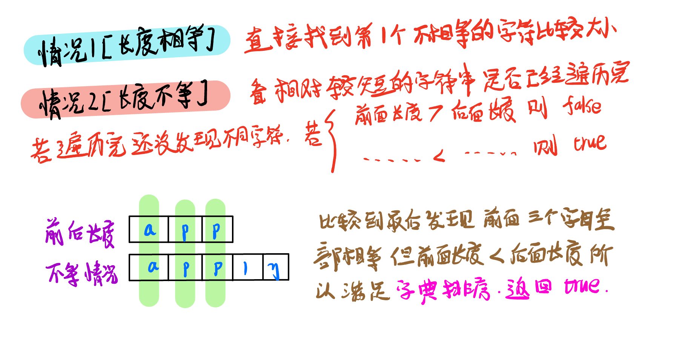 


 

## Stack


### 71. [Simplify Path](https://leetcode-cn.com/problems/simplify-path/)

Given a string `path`, which is an **absolute path** (starting with a slash `/`) to a file or directory in a Unix-style file system, convert it to the simplified **canonical path** (规范路径).

In a Unix-style file system, a period `'.'` refers to the current directory, a double period `'..'` refers to the directory up a level, and any multiple consecutive slashes (i.e. `'//'`) are treated as a single slash `'/'`. For this problem, any other format of periods such as `'...'` are treated as file/ directory names.

The **canonical path** should have the following format:

- The path starts with a single slash `'/'`.

- Ant two directories are separated by a single slash `'/'`.

- The path does not end with a trailing `'/'`.

- The path only contains the directories on the path from the root directory to the target file or directory (i.e., not period `'.'` or double period `'..'`) 

  > 路径仅包含从根目录到目标文件或目录的路径上的目录（即，不含 `'.'` 或 `'..'`）。

  return *the simplified **canonical path***.


**Example 1:**

```c#
Input: path = "/home/"
Output: "/home"
Explanation: Note that there is no trailing slash after the last directory name.
```

**Example 2:**

```c#
Input: path = "/../"
Output: "/"
Explanation: Going one level up from the root directory is a no-op, as the root level is the highest level you can go.
```

**Example 3:**

```c#
Input: path = "/home//foo/"
Output: "/home/foo"
Explanation: In the canonical path, multiple consecutive slashes are replaced by a single one.
```


<font size=5> 参考代码 </font>

```C#
public class Solution {
    public string SimplifyPath(string path) {
        string[] names = path.Split('/');
        var stack = new List<string>();
        foreach(string name in names){
            switch(name){
               
                case "..":
                if(stack.Count > 0 ){
                    /* 
                    当输入的是："/../" ，解析出来的是 .. 这时候 stack.Count == 0 
                    如果不加以判断就会出现 Index was out of range的异常
                    */
                    stack.RemoveAt(stack.Count -1);
                }

                break;

                case ".":
                break;
                
                case "":
                break;

                default:
                    stack.Add(name);
                break;
            }
        }

        //var ans =  stack.Aggregate((a, b) =>  a + "/ " + b);
        //stack.Insert(0,"/"); 这种方法不起作用，只会出现2个斜杆
        Console.WriteLine(String.Join("\n", stack)); //打印出List/Array元素
        var ans =  string.Join("/",stack.ToArray());
        ans =  "/"+ ans;
        return ans;
    }
}
```

- 学到了List可以当做Stack使用
- 知道了string.Join和List.Aggregate的用法；
- 知道了List.Insert(position, item)的用法
- 知道了如何快速打印list/array给前端展示 `Console.WritelLine(String.Join("\n",stack));`


### 1614. Maximum Nesting Depth of the Parentheses.

A string is  a **valid parentheses string** (denoted **VPS**) if it meets one of the following:

-  It is an empty string`""`, or a single character not equal to 


## Binary Search二分查找


### 思路与关键概念

<font size=5>1. Binary Search 算法复习</font>


- 双指针：先设定左侧下标 **left** 和右侧下标 **right**, 再计算中间下标 **mid**;
- 每次根据 **nums[mid]**和**target** 之间的大小进行判断：
  - 相等则直接返回下标；
  - **nums[mid]**<**target**,说明目标落在**`[mid+1,right]`** 区间内，则 **left** 右移
  - **nums[mid]>target**,目标落在**`[left,mid-1]`**内，则**right**右移
- 查找结束如果没有相等值则返回**left**,该值为插入位置


<font size=5>2. Why left+(right+left)/2 equals (left+right)/2?</font>

We can derive it from the mathematical formula.
$$
\begin{align*}
mid 
\\&=\frac{(left+right)}{2}
\\&=\frac{2left+right-left}{2}
\\&=left+\frac{(right-left)}{2}
\end{align*}
$$


<font size=5>3. [Why left+(right+left)2/ will not overflow](https://stackoverflow.com/questions/27167943/why-leftright-left-2-will-not-overflow#) </font>

You have $left < right$ by definition.

As a consequence:

 $right - left > 0$, 

and furthermore:

 $left + (right - left) = right$ 

(follows from basic algebra).

And consequently 

$left + (right - left) / 2 <= right$. 

So no overflow can happen since every step of the operation is bounded by the value of `right`.

------

By contrast, consider the buggy expression, $(left + right) / 2$. => $left + right >= right$,

and since we don’t know the values of `left` and `right`, it’s entirely possible that that value overflows.


### 704. Binary Search

> 右移相当于除以二
> 这样写防止两个大数相加溢出整型的最大值
>
> 
>
> 就是二进制，去掉最后一位
> 比如5-->101>>1  --> 10=2
>
>
> 没有必要在二分的时候用 >>，一是这样可读性不好，二是用 /2 编译器也会帮你优化掉，不需要自己手动优化
>
>
> 找没上市的家族企业啊，看你专业啊，丹麦的医疗 电气企业，瑞典的设备制造企业，英国的金融咨询服务公司，德国的传统制造企业，就差说名字了啊。都不是什么互联网企业，只要进公司就发现一公司懒比，为啥不说名字，我懂啊，怕你们这群奋斗逼进去卷啊。
>
>
> 在外企工作爽吗？ - 邵峋的回答 - 知乎
> https://www.zhihu.com/question/299766610/answer/2196046687

| Title                                                        | Type          | Date       |
| ------------------------------------------------------------ | ------------- | ---------- |
| [Search Insert Position](https://leetcode-cn.com/problems/search-insert-position/) | Binary Search | 2021-12-1  |
|                                                              |               | 2021-12-15 |
|                                                              |               | 2021-12-28 |


Given an array of integers `nums` which is sorted in ascending order, and an integer `target`, write a function to search `target` in `nums`. If `target` exists, then return its index. Otherwise, return `-1.`

You must write an algorithm with $O(log n)$ runtime complexity.

```c#
public class Solution{
    public int BinarySearch(int[] nums, int target)
    {
        int left = 0;
        int right = nums.Length -1;//这里一定要减去1，因为数组的下标是从0开始，而长度是从1开始；
        while(left<=right) //必须考虑==的情况，比如输入 [5],target=5,这种情况就会报错
        {
            int mid = (int)((left + right) /2);//默认向下取整
            if(target == nums[mid])
            {
                return mid;
            }
            if(target > nums[mid])
            {//目标值比中间值大，于数组右边，需调整left的指针.目标落座在[mid+1, right]
                left=mid +1;
            }
            if(target <num[mid])
            {//目标值比中间小，于数字左边，需要调整right的指针，目标坐落在[left,rigt-1]
                right = mid =1;
            }
        }
        return -1;
    }
}
```


### 278. [First Bad Version](https://leetcode-cn.com/problems/first-bad-version/)

You are a product manager and currently leading a team to develop a new product. Unfortunately, the latest version of your product fails the quality check. Since each version is developed based on the previous version, all the versions after a bad version are also bad.

Suppose you have `n` versions `[1, 2, ..., n]` and you want to find out the first bad one, which causes all the following ones to be bad.

You are given an API `bool isBadVersion(version)` which returns whether `version` is bad. Implement a function to find the first bad version. You should minimize the number of calls to the API.


**Example 1:**

```C#
Input: n = 5, bad = 4
Output: 4
Explanation:
call isBadVersion(3) -> false
call isBadVersion(5) -> true
call isBadVersion(4) -> true
Then 4 is the first bad version.
```


<font size=5> 参考代码 </font>

```C#
/* The isBadVersion API is defined in the parent class VersionControl.
      bool IsBadVersion(int version); */

public class Solution : VersionControl {
    public int FirstBadVersion(int n) 
    {
        int left = 0, right = n;
        while(left<right)
        {
            int mid = left+(right-left) /2;
            if(IsBadVersion(mid)) //[left,mid]
            {
                right = mid;
            }else{   
                 //[mid+1,right]
                /*为什么这里的mid要加1呢？
                因为调用IsBadVersion之后返回的是false,说明当前这个是好版本，
                那么坏版本一定是从当前这个好版本往后一个版本开始的，也就是mid+1开始
                2021年12月28日11:15:51
                */
                left = mid+1;
            }
        }
        return left;
    }
}
```


### 35. Search Insert Position

| Title                                                        | Type          | Date       |
| ------------------------------------------------------------ | ------------- | ---------- |
| [Search Insert Position](https://leetcode-cn.com/problems/search-insert-position/) | Binary Search | 2021-12-1  |
|                                                              |               | 2021-12-28 |

Given a sorted array of distinct integers and a target value, return the index if the target is found. If not, return the index where it would be if it were inserted in order.

You must write an algorithm with $$O(log n)$$ runtime complexity.

```c#
public class Solution {
    public int SearchInsert(int[] nums, int target) {
        int left=0, right = nums.Length -1;
        /*为什么这里要加上等号?
        因为出现类似这样的测试用例 [1,3,5,6] t =7,如果不加上等号，而return回来的又是left，
        就会出现输出为3（正确结果应该要为4）
        2021-12-28
        */
        while(left<=right)
        {
            int mid = left+(right-left)/2;
            if(nums[mid]==target)
            {
                return mid;
            }else if(target > nums[mid]){//[mid,right]
               /*这里之所以要加1，是因为要返回的是mid往后一个位置
                比如[1,3]，t=2, 这里的mid=0+1/2=0,则要往后移动一个下标 0+1 =1，
                在下标为 1 的位置插入
                */
             	left = mid+1;
            }else{
                /*
                这里如果不-1，则会在while(left =right)的时候永久的死循环 
                +1，-1 的结果就是让left,right最后合二为一，返回left
                2021-12-28*/
                 right = mid-1;
            }
        }
        return left;
    }
}
```


## Tow Pointers双指针

双指针的本质：

- 更像是一种编程技巧而非“算法”
- 利用问题本身所给定的序列特性（升序 or 降序）
- 使用两个下标（指针）对序列进行扫描，可以通向扫描，亦可反向（一指针从队头扫到队尾，另一指针从队尾扫到对头）
- 双指针对有序数组，字符串的问题特别有用


### 19. [Remove nth node from end of list](https://leetcode-cn.com/problems/remove-nth-node-from-end-of-list/)

Given the **`head`** of a linked list, remove the **n<sup>th</sup>** node from the list and return its head.

给你一个链表（上的head节点），删除链表的倒数第 `n` 个结点，并且返回链表的头结点。

**Example 1:**

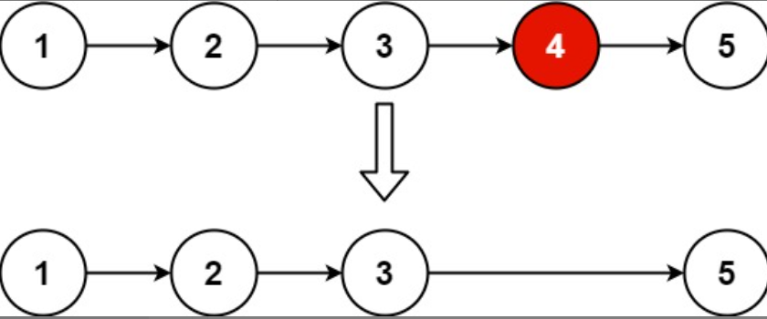

```c#
Input: head = [1,2,3,4,5], n = 2
Output: [1,2,3,5]
```

**Example 2:**

```c#
Input: head = [1], n = 1
Output: []
```

**Example 3:**

```c#
Input: head = [1,2], n = 1
Output: [1]
```


#### Dummy node

在对链表进行操作时，一种常用的技巧是添加一个[哑节点](https://leetcode-cn.com/problems/remove-nth-node-from-end-of-list/solution/shan-chu-lian-biao-de-dao-shu-di-nge-jie-dian-b-61/)（**dummy node**），它的**next** 指针指向链表的头节点。这样一来，我们就不需要对头节点进行特殊的判断了。

例如，在本题中，如果我们要删除节点 **y**，我们需要知道节点 **y** 的前驱节点 **x**，并将 **x** 的指针指向 **y** 的后继节点。但由于头节点不存在前驱节点，因此我们需要在删除头节点时进行特殊判断。但如果我们添加了哑节点，那么头节点的前驱节点就是哑节点本身，此时我们就只需要考虑通用的情况即可。

> 特别地，在某些语言中，由于需要自行对内存进行管理。因此在实际的面试中，对于「是否需要释放被删除节点对应的空间」这一问题，我们需要和面试官进行积极的沟通以达成一致。下面的代码中默认不释放空间。


<font size=5>双指针</font>


我们也可以在不预处理出链表的长度，以及使用常数空间的前提下解决本题。

由于我们需要找到倒数第 $n$ 个节点，因此我们可以使用两个指针 **first** 和 **second** 同时对链表进行遍历，并且**first** 比 **second**超前 **n** 个节点。当 **first** 遍历到链表的末尾时，**second** 就恰好处于倒数第 **n** 个节点。

具体地，初始时**first** 和 **second** 均指向头节点。我们首先使用 **first** 对链表进行遍历，遍历的次数为 **n**。此时，**first** 和 **second** 之间间隔了 $n−1$ 个节点，即 **first** 比 **second** 超前了 **n** 个节点。

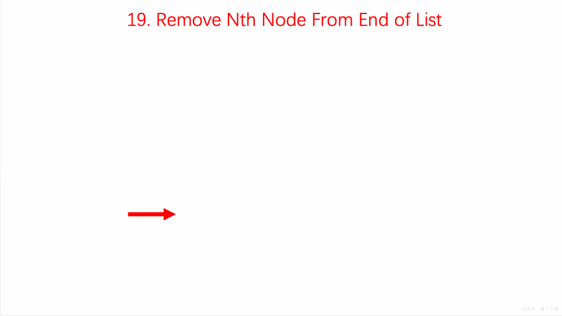

> 这个[动画](https://leetcode-cn.com/problems/remove-nth-node-from-end-of-list/solution/dong-hua-tu-jie-leetcode-di-19-hao-wen-ti-shan-chu/)实在是神来之笔

因此我们可以考虑在初始时将 **second** 指向哑节点，其余的操作步骤不变。这样一来，当**first** 遍历到链表的末尾时，**second** 的下一个节点就是我们需要删除的节点。

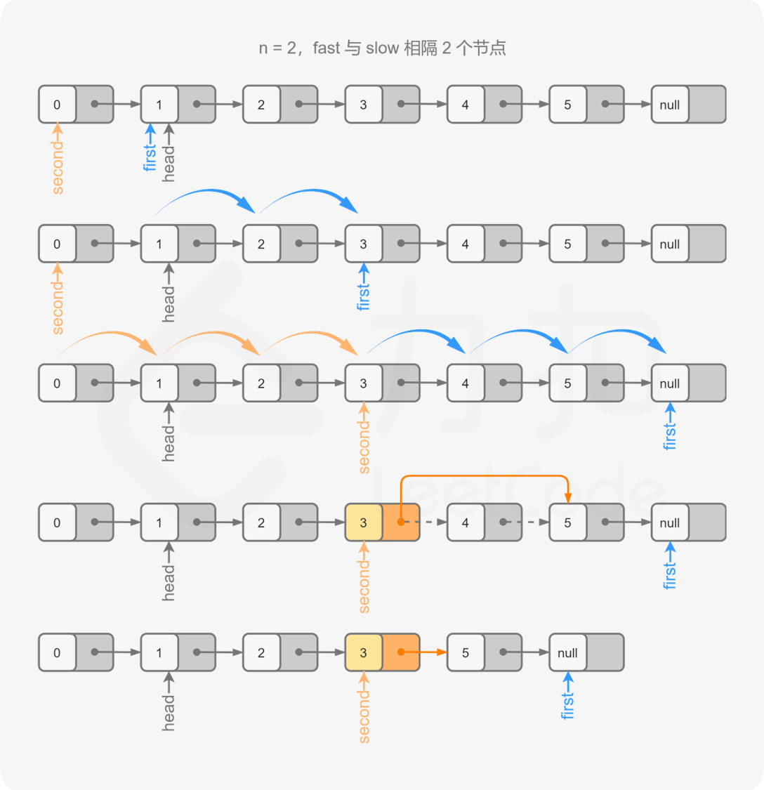


<font size=5>参考代码</font>

```c#
/**
 * Definition for singly-linked list.
 * public class ListNode {
 *     public int val;
 *     public ListNode next;
 *     public ListNode(int val=0, ListNode next=null) {
 *         this.val = val;
 *         this.next = next;
 *     }
 * }
 */
public class Solution {
    public ListNode RemoveNthFromEnd(ListNode head, int n) {
        /*往head上链表上插入全新的一个节点，生成一个全新的链表dummyList
        该dummyList有两个作用，一个是赋予second指针删除节点用，
        另一个是把删除过后的链表返回给方法*/
        ListNode dummyList = new ListNode(0,head);
        /*head是head，和dummyList是独立的两条链表，
        但是这样子无法解释该算法的空间复杂度为O（1）*/
        ListNode first = head;
        ListNode second = dummyList;
        for(int i=0;i<n;i++){ //先移动first指针往前n步
            first = first.next;
        }
        while(first!=null){
            first=first.next;
            second=second.next;
        }
        second.next=second.next.next;
    }
}
```

- 我对链表模型上可以理解，但是无法解释代码执行情况，说明还未彻底理解；（中文翻译也有点误导）。
-   `ListNode dummyList = new ListNode(0,head);`究竟是产生了一个全新的链表`dummyList`,还是只是产生一个新的节点？我在这两个认知中反复横条；
- 我是在尝试写备注，把每一句执行的过程记录下来的过程中发现了问题，才开始反思，否则就这样稀里糊涂过了，所以上面的备注随后以后追溯看起来很会很funny，不过这确实是一个过程，也确实是发现问题的关键所在，值得记录下来为后续的难题记录提供参考。
- 从字面意识上看 `dummyList`其实是一个节点，因为其类型是`ListNode`,而不是 `ListNode[]` 这样的东西；
- 由于我未能彻底理解`LinkedList`的结构，在**LeetCode**给出的有限的代码下做错误的理解，因此导致每次写代码都需要看提示。于是我就参考[Implementing Linked List In C#](https://www.c-sharpcorner.com/article/linked-list-implementation-in-c-sharp/)和[LinkedList<T> Class](https://docs.microsoft.com/en-us/dotnet/api/system.collections.generic.linkedlist-1?view=net-6.0)两片文章做进一步了解。
- 有时候编程需要深入了解才能彻底掌握，急不得，也不要急，大不了**LeetCode**代码多抄写几次，然后先卡在这些题目上几天、几个礼拜。每日的坚持比刷进度，从长远来看，更有效。


<font size=5>正确代码</font>

```C#
/**
 * Definition for singly-linked list.
 * public class ListNode {
 *     public int val;
 *     public ListNode next;
 *     public ListNode(int val=0, ListNode next=null) {
 *         this.val = val;
 *         this.next = next;
 *     }
 * }
 */
public class Solution {
    public ListNode RemoveNthFromEnd(ListNode head, int n) {
        /*往链表上新增一个DummyNode节点*/
        ListNode dummyNode = new ListNode(0,head);
        ListNode first = head;
        ListNode second = dummyNode;
        for(int i=0;i<n;i++){ //先移动first指针往前n步
            first = first.next;
        }
        while(first!=null){
            first=first.next;
            second=second.next;
        }
        //改变链表上的要删除的N点的前驱节点的后驱指针指向的位置
        second.next=second.next.next;
        //把哑节点的下一个节点（亦即head节点）传递给ans
        ListNode ans = dummyNode.next;
        return ans;
    }
}
```


### 27. Remove Element

| Title                                                        | Type         | Date      |
| ------------------------------------------------------------ | ------------ | --------- |
| [27. Remove Element](https://leetcode-cn.com/problems/remove-element/) | Tow Pointers | 2021-12-5 |

<font size=5>题目</font>

Given an integer array `nums` and an integer `val`, remove all occurrences of `val` in `nums` [in-place](https://en.wikipedia.org/wiki/In-place_algorithm). The relative order of the elements may be changed.

Since it is impossible to change the length of the array in some languages, you must instead have the result be placed in the **first part** of the array `nums`. More formally, if there are `k` elements after removing the duplicates, then the first `k` elements of `nums` should hold the final result. It does not matter what you leave beyond the first `k` elements.

> 由于在某些语言中不可能改变数组的长度，所以必须将结果放在数组nums的第一部分。
>
> 更正式地说，如果在删除重复项之后有k个元素，那么nums的前k个元素应该保存最终结果。除了前k个元素，剩下什么都没关系。

Return `k` after placing the final result in the first `k` slots of `nums`.

> 将最终结果放入nums的前k个槽位后返回k。

Do **not** allocate extra space for another array. You must do this by **modifying the input array** [in-place](https://en.wikipedia.org/wiki/In-place_algorithm) with $O(1)$ extra memory.

> 不要使用额外的数组空间，你必须仅使用 `O(1)` 额外空间并 **[原地 ](https://baike.baidu.com/item/原地算法)修改输入数组**。


<font size=5>图解过程</font>

 

**Reference:**

1. [27. 移除元素](https://programmercarl.com/0027.%E7%A7%BB%E9%99%A4%E5%85%83%E7%B4%A0.html#%E6%80%9D%E8%B7%AF)
2. 


### [167. Two Sum II - Input Array Is Sorted](https://leetcode.cn/problems/two-sum-ii-input-array-is-sorted/)

Given a **1-indexed** array of integers `numbers` that is already ***sorted in non-decreasing order***, find two numbers such that they add up to a specific `target` number. Let these two numbers be `numbers[index1]` and `numbers[index2]` where `1 <= index1 < index2 <= numbers.length`.

Return the indices of the two numbers, `index1` and `index2`, ***added by one*** as an integer array `[index1, index2]` of length 2.

The tests are generated such that there is ***exactly one solution***. You **may not** use the same element twice.

Your solution must use only constant extra space.

```C#
Example 1:

Input: numbers = [2,7,11,15], target = 9
Output: [1,2]
Explanation: The sum of 2 and 7 is 9. Therefore, index1 = 1, index2 = 2. We return [1, 2].
```


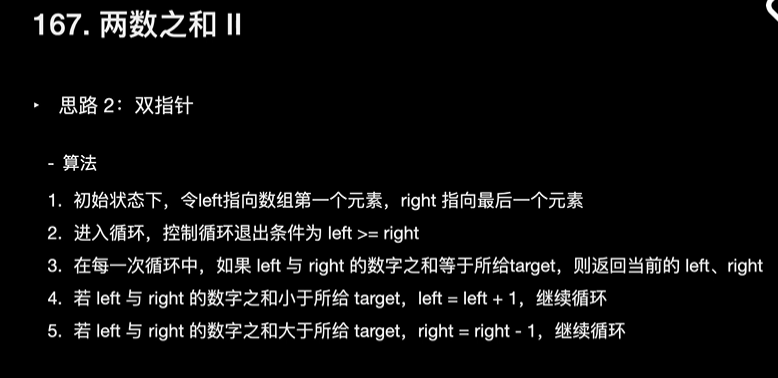 


**答案(Python3)**

```python
class Solution:
    def twoSum(self, numbers: List[int], target: int) -> List[int]:
        left, right = 0, len(numbers) -1 #初始化，left指向首元素，right指向末元素
        while left <= right: #控制循环退出条件
            sum = numbers[left] + numbers[right]
            if sum == target:
                return [left + 1, right + 1]
            elif sum < target:
                left += 1
            else:
                right -= 1
        return [-1, -1]

```

- 空间复杂度： 只需要使用常数个局部变量，复杂度为 O（1）
- 时间复杂度：使用双指针，总共只对数组进行了一次遍历，故时间复杂度为 O(n)。


### 189.Rotate array

| Title                                                        | Type         | Date       |
| ------------------------------------------------------------ | ------------ | ---------- |
| [189. Rotate array](https://leetcode-cn.com/problems/rotate-array/solution/xuan-zhuan-shu-zu-by-leetcode-solution-nipk/) | Tow Pointers | 2021-12-4  |
|                                                              |              | 2021-12-15 |


<font size =5> 题目</font>

Given an array, **rotate** the array **to the right** by `k` steps, where `k` is non-negative

给定一个数组，将数组中的元素向右移动 `k` 个位置，其中 `k` 是非负数。

**Example 1:**

```javascript
Input: nums = [1,2,3,4,5,6,7], k = 3
Output: [5,6,7,1,2,3,4]
Explanation:
rotate 1 steps to the right: [7,1,2,3,4,5,6]
rotate 2 steps to the right: [6,7,1,2,3,4,5]
rotate 3 steps to the right: [5,6,7,1,2,3,4]
```

**Follow up:**

- Try to come up with as many solutions as you can. There are at least three different ways to solve this problem.
- Could you do it in-place with `O(1)` extra space?


<font size=5>取模（2021-9-17）</font>

这里必须要取模（需要考虑向右移动次数超出数组本身的长度的情况）：这里只有7个元素，向右边移动7次，其实等于没有移动；向右移动8次等于向右移动1次，所以**8%7=1**；


<font size=5>解题思路</font>

观察:

输入: nums = [1,2,3,4,5,6,7], k = 3
输出: [5,6,7,1,2,3,4]

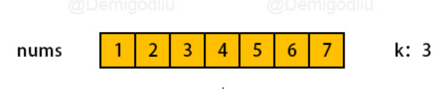


- **[S1:翻转整个数组](https://leetcode-cn.com/problems/rotate-array/solution/shu-zu-fan-zhuan-xuan-zhuan-shu-zu-by-de-5937/)**


- **S2: 从第K个元素后，将数组划分为左右两快字数组**

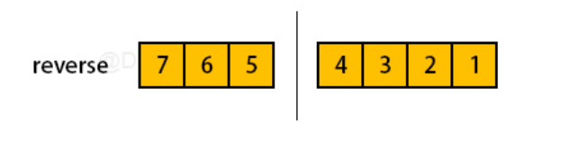

- **S3:左右两组子数组，各自翻转**

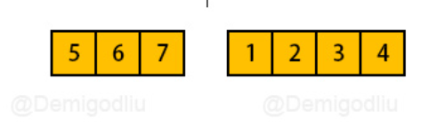

- **S4:Done**

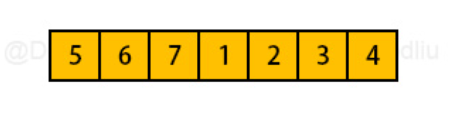


该方法基于如下的事实：当我们将数组的元素向右移动 `k` 次后，尾部 $k\mod n$ 个元素会移动至数组头部，其余元素向后移动 个$k\mod n$位置。

该方法为数组的翻转：我们可以先将所有元素翻转，这样尾部的 $k\mod n$个元素就被移至数组头部，然后我们再翻转 **[0,k mod n−1]** 区间的元素和 **[k mod n,n−1]** 区间的元素即能得到最后的答案。


<font size=5>参考代码</font>

```c#
public class Solution {
    public void Rotate(int[] nums, int k) {
        k= k%nums.Length;//-->: k= k % nums.Length;
        reverseArr(nums,0,nums.Length-1);//第一次全翻转
        reverseArr(nums,0,k-1);//第二次翻转左边部分，由于end是数组的下标，所以需要k-1;
        reverseArr(nums,k,nums.Length-1);//翻转右边部分，如果不能理解这里为什么不需要k-1,可以参考上图的k=3的位置
    }
    private void reverseArr(int[]nums, int start, int end){
        while(start<=end){
            int temp = nums[start];
            nums[start] =nums[end];
            nums[end] =temp;
            start++;
            end--;
        }
    }
}
```


### 283.Move Zeros

| Title                                                        | Type         | Date       |
| ------------------------------------------------------------ | ------------ | ---------- |
| [283. Move Zeros](https://leetcode-cn.com/problems/move-zeroes/) | Tow Pointers | 2021-12-5  |
|                                                              |              | 2021-12-17 |
|                                                              |              | 2021-12-30 |

<font size=5> 题目</font>

Given an integer array `nums`, move all `0`'s to the end of it while maintaining the relative order of the non-zero elements.

**Note** that you must do this in-place without making a copy of the array.

Example 1:

```csharp
Input: nums = [0,1,0,3,12]
Output: [1,3,12,0,0]
```

Example 2:

```csharp
Input: nums = [0]
Output: [0]
```

**Follow up:** Could you minimize the total number of operations done?


<font size=5>参考代码</font>

```csharp
public class Solution {
    public void MoveZeroes(int[] nums) {
        int left =0, right= 0;
        while(right < nums.Length){
            if(nums[right]!=0){
                Swap(nums,left,right);
                /*做了交换之后，left指针当前的位置已经不再是0了，
                则需要继续往左边移动一位，左指针保持不动，这时候左右之争指向同一个位置*/
                left++;
                //right++
            }
            /*等于零，说明此时left,right都是0， 
            不需要做交换，但是需要确保right指针往右继续移动*/
            right++;
        }
    }

    private void Swap(int[] nums, int left, int right){
        int temp = nums[left];
        nums[left] =nums[right];
        nums[right] = temp;
    }
}
```


使用双指针，左指针指向当前已经处理好的序列的尾部，右指针指向待处理序列的头部）这句话难以理解的话，参考下图的S4。

**右(l)**指针不断向右移动，每次右指针指向非零数，则将左右指针对应的数交换，同时左指针右移。

注意到以下性质：

- 左指针左边均为非零数；
- 右指针左边直到左指针处均为零。

因此每次交换，都是将左指针的零与右指针的非零数交换，且非零数的相对顺序并未改变。

<font size=5>图解过程</font>

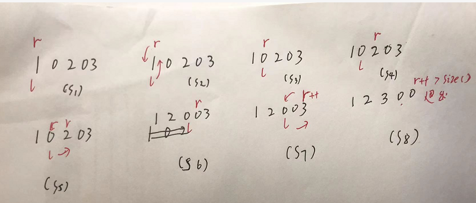


正如当初我需要使用图解去理解Binary Search一样，这次双指针也是第一次遇到，过程很难理解，只能根据代码把整个执行过程都review一次，才能彻底入门。

- 对于我来说，难点在于S1和S2， 我一直以为S1之后会，right是直接跳到数组的第2个位置（亦即0），然后left还是停留在第1个位置；
- 实际上，S1会立即开始执行交换，且执行left++和right++;由于第一步理解错了，我对整个执行的过程推导都是错的，于是只能打开visual studio单步调试才正确理解；
- 对于这样的case来说，第一次需要花很长时间，且需要经验积累，跟需要同步调试。过了这关，后续相关的问题，会如Binary Search一样相当好理解了。

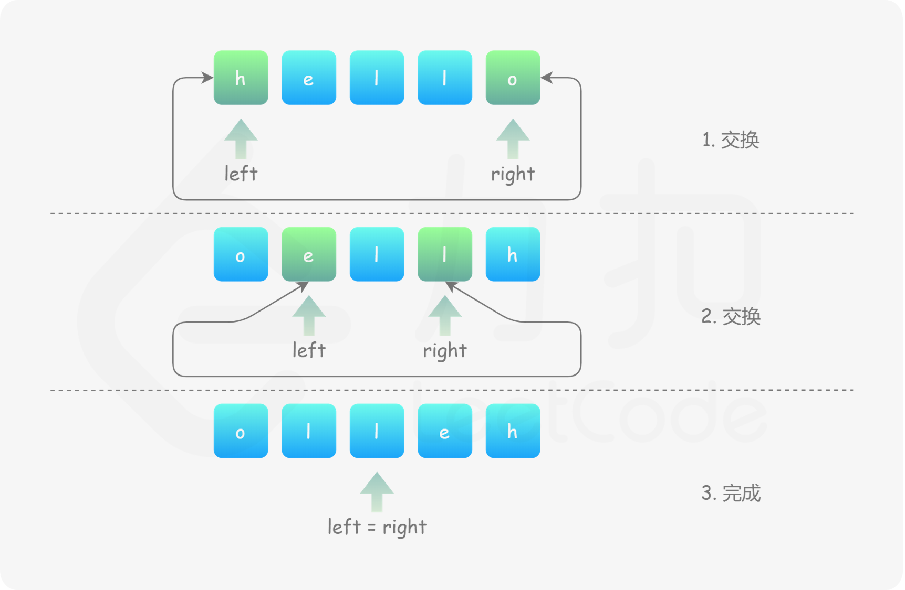


### [557. Reverse Words in a String III](https://leetcode.cn/problems/reverse-words-in-a-string-iii/)

- 这里也牵涉到双指针，但是需要对字符串怎么分割处理和append也是属于难点。
- 官网的解答看起来很吃力，后来在另一个[高赞的帖子](https://leetcode.cn/problems/reverse-words-in-a-string-iii/solution/python-fan-zhuan-zi-fu-chuan-zhong-dan-ci-si-lu-xi/)下找到了一份Java答案更好理解

Given a string `s,` reverse the order of characters in each word within a sentence while still preserving whitespace and initial word order.

```C#
Example 1:

Input: s = "Let's take LeetCode contest"
Output: "s'teL ekat edoCteeL tsetnoc"
```


```java
class Solution {
    public String reverseWords(String s) {
        //因为字符串不可变，所以必须定义一个可变的字符串来存储新的字符
        StringBuilder ans = new StringBuilder();
        //遍历原字符串，取出单个单词，以空格分开
        for(String str: s.trim().split(" ")){
            //将取出的单词，转化为字符数组的形式
            char[] chars = str.toCharArray();
            //反转单词
            reverseString(chars);
            //将反转后的单词，追加到新的可变字符串中，并加上空格
            ans.append(chars).append(" ");
        }
        //将字符数组转为字符串形式输出，并删除头尾的空格
        //因为在追加最后一个字符的时候，末尾会有一个空格
        return ans.toString().trim();
    }
    public void reverseString(char[] chars){
        //左指针，指向头部
        int left = 0; 
        //右指针，指向尾部
        int right= chars.length-1;
        //只要左指针小于右指针，就交换两个字符
        while(left < right){
            char temp = chars[left];
            chars[left] = chars[right];
            chars[right] = temp;
            //两个指针同时移动
            left++;
            right--;
        }
    }
}
```


**C#1** ：

```C#
public class Solution {
    public string ReverseWords(string s) {
        StringBuilder sb = new StringBuilder();
        foreach(var str in s.Trim().Split(" ")){
            char[] chars = str.ToCharArray();
            ReverseString(chars);
            sb.Append(chars).Append(" ");
        }
        return sb.ToString().Trim();
    }

    public void ReverseString(char[] chars){
        int left = 0, right = chars.Length - 1;
        while (left < right){
            char temp = chars[left];
            chars[left] = chars[right];
            chars[right] = temp;
            left += 1;
            right -= 1;
        }
    }
}
```


**C#2:**

```C#
public class Solution {
    public string ReverseWords(string s) {
        return string.Join(" ",ReverseStr(s).ToArray());
    }

    public IEnumerable<string> ReverseStr(string str){
        foreach(var item in str.Split(" ")){
            yield return string.Join("",item.ToCharArray().Reverse());
        }
    }
}
```

- 这里的 yield return的作用是以IEnumerable集合形式返回


**C#3：**

```C#
public class Solution {
    public string ReverseWords(string s) {
       StringBuilder sb = new StringBuilder();
        foreach (var item in s.Split(" ")){
            sb.Append(string.Join("",item.ToArray().Reverse())).Append(" ");
        }
        return sb.ToString().Trim();
    }
}
```

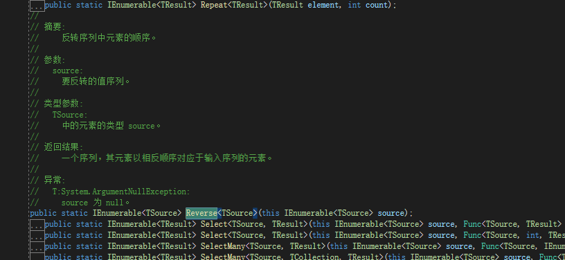 


**Python**

```python
class Solution:
    def reverseWords(self,s:str) -> str:
        return " ".join(word[::-1] for word in s.split(" "))
```


### 876. Middle of the Linked List

| Titile                                                       | Type         | Date       |
| ------------------------------------------------------------ | ------------ | ---------- |
| [Middle of the Linked List](https://leetcode-cn.com/problems/middle-of-the-linked-list/) | Two Pointers | 2021-12-10 |
|                                                              |              | 2021-12-18 |
|                                                              |              |            |

这题是对链表这种陌生结构的第一次了解。

<font size=5> 题目</font>

Give the `head` of a singly linked list, return *the middle node of the linked list*.

If there are two middle nodes, return **the second middle** node. 

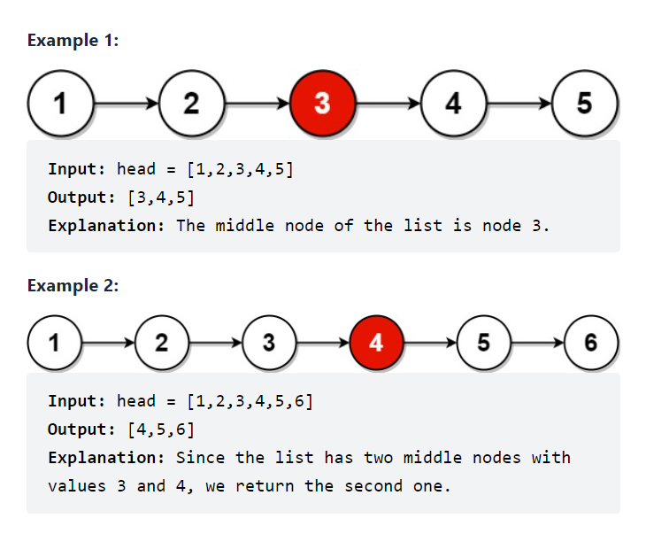

<font size=5>参考代码</font>

```c#
public class Solution {
    public ListNode MiddleNode(ListNode head) {
        var slow=head, fast=head;
        /*
        注意题目要求如果存在两个中间节点，则返回第二个。
        因此快指针fast可以前进的条件是，当前快指针和
        快指针的下一个节点都非空。
        */
        while(fast!=null && fast.next!=null)
        {
            /*
            慢指针slow走一步，快指针fast走两步
            */
            slow = slow.next;
            fast = fast.next.next;
        }
        return slow;
    }
}
```

<font size=5>图解过程</font>

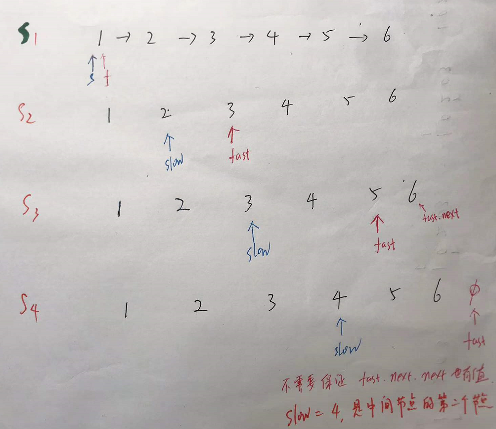

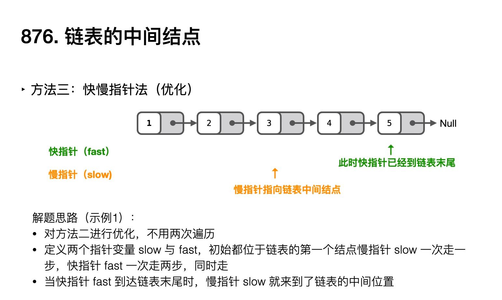

### 977. Squares of a sorted array

| Title                                                        | Type         | Date      |
| ------------------------------------------------------------ | ------------ | --------- |
| [977. Squares of a Sorted Array](https://leetcode-cn.com/problems/squares-of-a-sorted-array/) | Tow Pointers | 2021-12-3 |


<font size=5> 解题思路 </font>

数组其实是有序的， 只不过负数平方之后可能成为最大数了。

那么数组平方的最大值就在数组的两端，不是最左边就是最右边，不可能是中间。

此时可以考虑双指针法了，i指向起始位置，j指向终止位置。

定义一个新数组result，和A数组一样的大小，让k指向result数组终止位置。

如果`A[i] * A[i] < A[j] * A[j]` 那么`result[k--] = A[j] * A[j];` 。

如果`A[i] * A[i] >= A[j] * A[j]` 那么`result[k--] = A[i] * A[i];` 。

- [Reference](https://leetcode-cn.com/problems/squares-of-a-sorted-array/comments/) 


<font size=5>算法图解</font>

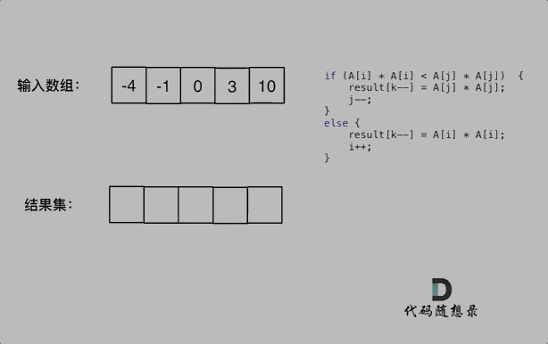


<font size=5>参考代码</font>

```C#
public class Solution {
    public int[] SortedSquares(int[] nums) {
    	//i 是数组开头位置， j是数组结尾位置， pos是返回的数组在当前循环内最大的数组
     	int i = 0, j = nums.Length -1, pos = nums.Length -1;
     
    	// int[] ans = new int[nums.Length-1]; // 数组越界！
   		int[] ans = new int[nums.Length];
   		// while(i<j)  [-7,-3,2,3,11] => [0,9,9,49,121]
        while(i<=j)
        {
             if(nums[i] * nums[i] > nums[j] * nums[j])
             {
                 ans[pos] = nums[i] * nums[i];
                 //确认了是i最大，因此移动i指针到下一位进行比较
                i++;
             }
             else
             {
                 ans[pos] = nums[j] * nums[j];
                 //反之，如果确认是j更大，把更大的值赋予ans数组的最大位(pos),并且修改j指针的位置
                 j--;
             }
             //every iterated, need to change the pointer of pos(self minus) 
             pos-- ;
         }
         return ans;
    }
}
```

1


## [滑动窗口](https://leetcode-cn.com/problems/longest-substring-without-repeating-characters/solution/hua-dong-chuang-kou-by-powcai/)

<font size =5>什么是滑动窗口？</font>

其实就是一个队列,比如例题中的 `abcabcbb`，进入这个队列（窗口）为 `abc` 满足题目要求，当再进入 `a`，队列变成了 `abca`，这时候不满足要求。所以，我们要移动这个队列！

如何移动？

我们只要把队列的左边的元素移出就行了，直到满足题目要求！

一直维持这样的队列，找出队列出现最长的长度时候，求出解！

时间复杂度：$O(n)$


###  [3. Longest substring without repeating character](https://leetcode-cn.com/problems/longest-substring-without-repeating-characters/)

Given a string **s**, find the length of the **longest substring** without repeating characters.

给定一个字符串 **s** ，请你找出其中不含有重复字符的 **最长子串** 的长度。

 

示例 1:

```c#
输入: s = "abcabcbb"
输出: 3 
解释: 因为无重复字符的最长子串是 "abc"，所以其长度为 3。
```

示例 3:

```c#
输入: s = "pwwkew"
输出: 3
Explanation: The answer is "wke", with the length of 3.
Notice that the answer must be a substring, "pwke" is a subsequence and not a substring.

解释: 因为无重复字符的最长子串是 "wke"，所以其长度为 3。
     请注意，你的答案必须是 子串 的长度，"pwke" 是一个子序列，不是子串。
```


<font size=5> C#代码 </font>

```C#
public class Solution {
    public int LengthOfLongestSubstring(string s) {
        // 哈希集合，记录每个字符是否出现过
        //Hashset<char> cSet = new Hashset<char>();
        HashSet<char> cSet = new HashSet<char>();
        int rk=0;//右指针
        int ans = 0; //答案 answers
        for (int i=0;i<s.Length-1;i++) //左指针
        {
            if(i!=0)
            {
                // 左指针向右移动一格，移除一个字符
                cSet.Remove(s[i-1]);
            }
            //如果当前哈希表不包含rk字符，则纳入到哈希表
            while(rk < s.Length-1 && !cSet.Contains(s[rk])) 
            {
              // 不断地移动右指针 
              cSet.Add(s[rk]);
              rk++;
            }
            // 第 i 到 rk 个字符是一个极长的无重复字符子串
            ans = Math.Max(ans,rk-i);
        }
        return ans;
    }
}
```


- 为什么一定要让rk=-1, 直接等于0不是更加单吗？

  因为尼玛的竟然有空字符串的情况：

  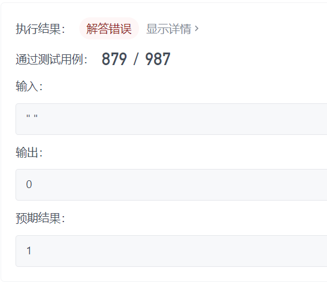 


```C#
public class Solution {
    public int LengthOfLongestSubstring(string s) {
        // 哈希集合，记录每个字符是否出现过
        //Hashset<char> cSet = new Hashset<char>();
        HashSet<char> cSet = new HashSet<char>();
        int rk = -1;//右指针
        int ans = 0; //答案 answers
        for (int i = 0;i < s.Length; i++) //左指针
        {
            if(i != 0)
            {
                // 左指针向右移动一格，移除一个字符
                cSet.Remove(s[i-1]);
            }
            //如果当前哈希表不包含rk字符，则纳入到哈希表
            while(rk+1 < s.Length && !cSet.Contains(s[rk+1])) 
            {
              // 不断地移动右指针 
              cSet.Add(s[rk+1]);
              rk++;
            }
            // 第 i 到 rk 个字符是一个极长的无重复字符子串
            ans = Math.Max(ans,rk-i+1);
        }
        return ans;
    }
}
```


调整之后调试通过，一开始以为 rk=-1是多此一举。。。。


<font size =5> 图解过程 </font>


以字符串**pwwkew**为例：

- S1: 很明显，我们需要遍历整个（改字符串的）数组，来建立**散列表**(**Dictionary** / **Hashset**)。

  >  由于我们需要用到子串，所以需要下标的信息

 

- S2: 首先是第一个字符 **p**， 由散列表中没有该记录，因此可以插入散列表中；此时，子串，或者说 移动窗口的长度 加1。

 


- S3：第二个字符**w**情况和S2类似，因此插入w到散列表中，子串的长度继续加1；

 

- S4： 第三个字符又是**w**,由于该字符串已经存在散列表内了，所以我们需要收缩窗口（子串）。具体收缩多少，取决于之前那个**w**出现的位置 和 现在的子串从哪里开始。窗口需要收缩**起始点**：如果当前子串已经包含**w**，那么收缩应该使得**子串刚好排除第一个`w`**。因此收缩后的子串变成了**w**。

   

- 然后我们再看下一个子串**k**，可以插入散列表，因此移动窗口长度+1，把**k**也包含进来：

   

- 同样，**e**也是如此操作：
  


### 567.  [Permutation in string](https://leetcode-cn.com/problems/permutation-in-string/)

Given two string `s1` and `s2`, return `true` ***if** `s2` contains a permutation of `s1`, or `fase` otherwise.*

In other words, return `true` if one of `s1`'s permutation is the substring of `s2`.


**Example 1:**

```C#
Input: s1 = "ab", s2 = "eidbaooo"
Output: true
Explanation: s2 contains one permutation of s1 ("ba").
```


**Example 2:**

```C#
Input: s1 = "ab", s2 = "eidboaoo"
Output: false
```


**Constraints:**

- `s1` and `s2` consist of lowercase English letters.


#### `char[i] - a`: What does substracting a char by a char mean? (ASCII码)

The goal is count the occurrences of each character.

```C#
c - 'a'
```

is a kind of clever way to get the position of the character in the alphabet. `'a' - 'a'` would give you 0. `'b' - 'a'` would give you 1. `'c' - 'a'` would give you 2, and so on.

That value is used as an index into the array (which as you correctly stated is initialized with zeros) and the count is incremented.

It's worth noting that this will break if any character other than `a-z` is present in the string (including uppercase characters), and you'd see an [`IndexOutOfBoundsException`](https://docs.oracle.com/javase/9/docs/api/java/lang/IndexOutOfBoundsException.html)


还用到[这题](https://leetcode.cn/problems/verifying-an-alien-dictionary/solution/yan-zheng-wai-xing-yu-ci-dian-by-leetcod-jew7/)：

 

```c#
string order = "leewa";
int[] index = new int[26];
for (int i = 0; i < order.Length; ++i) {
    index[order[i] - 'a'] = i;
}
//这段代码我在2022年5月17日10:44:09间隔4个月后重新去刷LeetCode已经看不大懂，只能使用Debugger调试看一遍：
```


| [i]      | order[i] | order[i] - 'a'        | Index[order[i] - 'a']      |
| -------- | -------- | --------------------- | -------------------------- |
| order[0] | 108 'l'  | 108 'l' - 97 'a' = 11 | index[11] = **0** (不是1)  |
| order[1] | 101 'e'  | 101 'e' - 97 'a' = 4  | index[4] = 1               |
| order[2] | 101 'e'  | 101 'e' - 97 'a' = 4  | index[4] = **2** （不是1） |
| order[3] | 119 'w'  | 110 'w' - 97 'a' = 22 | index[22] = **3**          |
| order[4] | 97 'a'   | 97 'a' -97 'a' = 0    | index[0] = **4**           |

- 请注意不要出现大写字母，否则就会出现数组越界，比如出现'W'，对应的ASCII码是 87， 那么 87 W’ - 97 ‘a' = - 10. Index[-10]出现编译报错。


**Reference:**

1. [Java: What does subtracting a char by a char mean?](https://stackoverflow.com/questions/48424217/java-what-does-subtracting-a-char-by-a-char-mean)

   

#### `arr[i] - 0` [why subtract '0'?](https://stackoverflow.com/questions/21617298/c-array-push-why-subtract-0)


The expression `c - '0'` is converting from the character representation of a number to the actual integer value of the same digit. For example it converts the char `'1'` to the int `1`

I think it makes a bit more sense to look at complete examples here

```c
int charToInt(char c) { 
  return c - '0';
}

charToInt('4') // returns 4
charToInt('9') // returns 9 
```


It's not subtracting zero... It's subtracting the ASCII value of the character '0'.

Doing so gives you an ordinal value for the digit, rather than its ASCII representation. In other words, it converts the characters '0' through '9' to the numbers 0 through 9, respectively.

 

**'9'-'0' 就是 57-48 == 9**

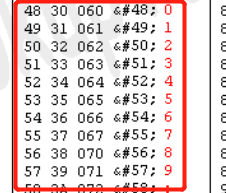 


**另外需要注意区分，这个十进制的9，对应的是 Horizontal Tab；而char=9,对应十进制是57：**

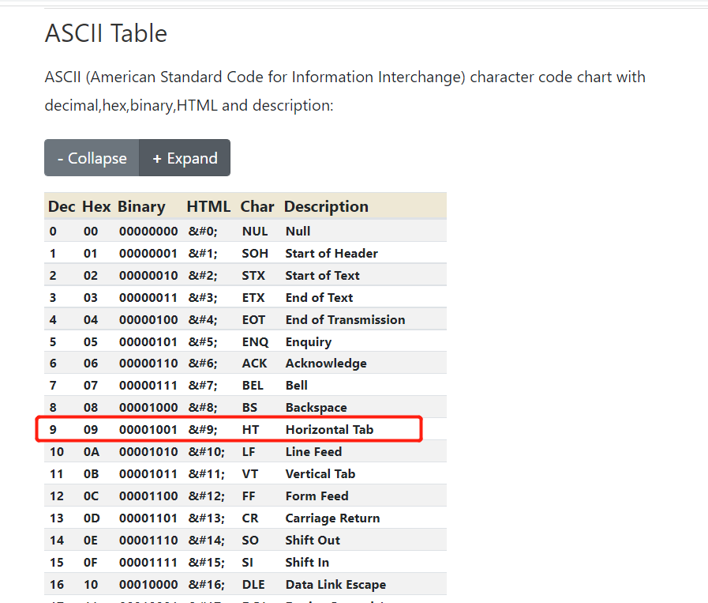 


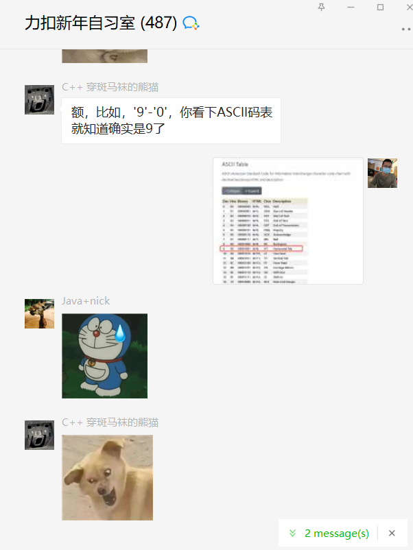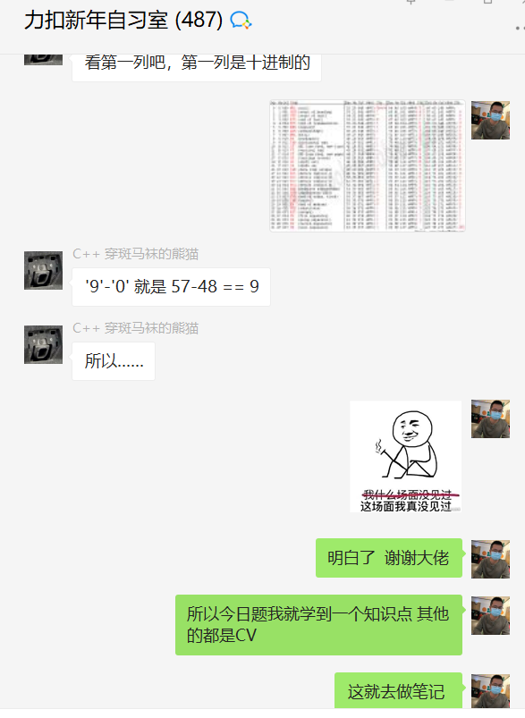

**Reference:**

1. [C array push, why subtract '0'?](https://stackoverflow.com/questions/21617298/c-array-push-why-subtract-0)


####  [How to compare arrays in C#?](https://stackoverflow.com/questions/4423318/how-to-compare-arrays-in-c) 

You can use the Enumerable.SequenceEqual() in the System.Linq to compare the contents in the array

```C#
bool isEqual = Enumerable.SequenceEqual(target1, target2);
```


You could use [`Enumerable.SequenceEqual`](https://docs.microsoft.com/en-us/dotnet/api/system.linq.enumerable.sequenceequal). This works for any `IEnumerable<T>`, not just arrays.


> Great answer, and I know it's a little late, but that could be simplified to this: **bool isEqual = target1.SequenceEqual(target2)**


<font size =5> 解题思路 </font>

由于排列不会改变字符串中每个字符的个数，所以只有当两个字符串每个字符的个数均相等时，一个字符串才是另一个字符串的排列。

根据这一性质，记 `s1` 的长度为 `n` , 我们可以遍历`s2`中的每个长度为`n`的*子串*, 判断子串和`s1`中每个字符的个数是否相等，若相等则说明该子串是`s1`的一个排列。

使用两个数组`cnt1`和`cnt2`: `cnt1`统计`s1`中各个字符的个数, `cnt2`统计当前遍历的子串中各个字符的个数。

由于需要遍历的子串长度均为`n`,我们可以使用一个固定长度为 `n`的**滑动窗口**来维护`cnt2`: 滑动窗口每向右滑动一次，就多统计一次进入窗口的字符，少统计一次离开窗口的字符。然后，判断`cnt1`是否与`cnt2`相等，若相等则意味着 `s1`的排列是`s2`啊的子串。


<font size=5> 参考代码 </font>

```c#
public class Solution {
    public bool CheckInclusion(string s1, string s2) {
        int n = s1.Length, m = s2.Length;
        if(n>m)
        {
            return false;
        }
        int[] cnt1 = new int[26];
        int[] cnt2 = new int[26];

        for(int i=0;i<n;i++)
        {
            cnt1[s1[i]-'a']++;
            cnt2[s2[i]-'a']++;
        }
        if(Enumerable.SequenceEqual(cnt1,cnt2))
        {
            return true;
        }
        for(int i =n; i<m;i++)//滑动 n个窗口
        {
            cnt2[s2[i]-'a']++; 
            cnt2[s2[i-n]-'a']--;
            if(cnt2.SequenceEqual(cnt1))
            {
                return true;
            }
        }
        return false;
    }
}
```


## 广度优先搜索 / 深度优先搜索


### 733. [Flood fill](https://leetcode-cn.com/problems/flood-fill/)

An image is represented by an `mxn` integer grid `image` where `image[i][j]`represents the pixel value of the image.

You are also given three integers `sr`,`sc`,and `newColor`. You should perform a **flood fill** on the images starting from the pixel `images[sr][sc]`.

To perform a **flood fill**, consider the starting pixel, plus any pixels connected **4-directionally** to those pixels (also with the same color), and so on. Replace the color of all the aforementioned pixels with `newColor`.

Return *the modified image after performing the flood fill.*


```c#
Input: image = [[1,1,1],[1,1,0],[1,0,1]], sr = 1, sc = 1, newColor = 2
    
Output: [[2,2,2],[2,2,0],[2,0,1]]

Explanation: 
From the center of the image with position (sr, sc) = (1, 1) (i.e., the red pixel), all pixels connected by a path of the same color as the starting pixel (i.e., the blue pixels) are colored with the new color.
Note the bottom corner is not colored 2, because it is not 4-directionally connected to the starting pixel.

在图像的正中间，(坐标(sr,sc)=(1,1)), 在路径上所有符合条件的像素点的颜色都被更改成2。注意，右下角的像素没有更改为2，因为它不是在上下左右四个方向上与初始点相连的像素点。
```


<font size=5>参考代码 </font>

```c#
public class Solution {
    int[] dx={1,0,0,-1};
    int[] dy={0,1,-1,0};
    public int[][] FloodFill(int[][] image, int sr, int sc, int newColor) 
    {
        int oldColor = image[sr][sc];
        if(oldColor!=newColor)
        {
            dsf(image,sr,sc,oldColor,newColor);
        }
        return image;
    }

    private void dsf(int[][] image,int r, int c,int oldColor, int newColor)
    {
        if(image[r][c]==oldColor)
        {
            image[r][c] = newColor;
            for(int i = 0; i<4;i++)
            {
                int mr = r + dx[i],mc = c+dy[i];
                if(mr>=0 && mr<image.Length && mc>=0 && mc<image[0].Length)
                {
                    dsf(image,mr,mc,oldColor,newColor);
                }
            }
        }
    }
}
```


<font size=5> 上下左右四个方向的偏移量</font>

问：

```c#
 int[] dx = {1, 0, 0, -1}; 
 int[] dy = {0, 1, -1, 0}; 
```

这两个什么意思啊

答：上下左右四个方向的偏移量；


即便有大佬给出了[答案](https://leetcode-cn.com/problems/flood-fill/solution/tu-xiang-xuan-ran-by-leetcode-solution/)，一时间还是有点难以理解，为什么dx一定是 `{1,0,0,-1}`，而不是 `{1,-1}`呢？

这个需要往回追溯之前更简单的，更易于理解，但是不那么简洁的代码：

```C#
// sr表示 row, sc表示column
public int[][] floodFill(int[][] image, int sr, int sc, int newColor) {
        int oldColor = image[sr][sc];
        if(oldColor == newColor){
            return image;
        }else {
            image[sr][sc] = newColor;
        }
        //存在上
        if(sr - 1 >= 0 && image[sr-1][sc] == oldColor){
            floodFill(image,sr-1,sc,newColor);
        }
        //存在下
        if(sr + 1 < image.length && image[sr+1][sc] == oldColor){
            floodFill(image,sr+1,sc,newColor);
        }
        //存在左
        if(sc - 1 >= 0 && image[sr][sc-1] == oldColor){
            floodFill(image,sr,sc-1,newColor);
        }
        //存在右
        if(sc + 1 < image[sr].length && image[sr][sc+1] == oldColor){
            floodFill(image,sr,sc+1,newColor);
        }
        return image;
    }
```


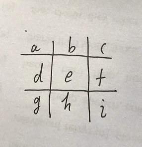

如上图的一个矩阵所所示：

- image\[0][0]=a;	 image\[0][1]=b; 	image\[0][2]=c;  由此可以看出，移动第二个下标，指针会在a\b\c（同一个row的)三个**column**之间转跳检索;
- image\[0][0]=a;   image\[1][0]=d; image\[2][0]=g;  移动第一个下标，指针会在 a\d\g(同一个column下的)三个不同row之间转跳检索；

**由此可得出结论：**

- 改变第一个下标，则会在上下这个放下检索数据；
- 改变第二个下标，则会在左右这个放下检索数据。

我之前理解困难的原因：

- 移动第二个下标，明明就是改变row的位置嘛， 怎么就是改变column的位置呢?实在是是改变**同一个Row上的不同column**。这样解释是不是更能帮助自己理解？

- 有时候初学者的思维就会卡在这里面，会强烈的认为事情A是B，这时候需要反复阅读、抄写，画图理解则显得尤为重要。通过学这些算法，能深刻帮助理解孩子在学习过程中的思维以及如何引导。


### 617. [Merge two binary trees](https://leetcode-cn.com/problems/merge-two-binary-trees/)

You are given two binary trees `root1` and `root2`.

Imagine that when you put one of them to cover the other, some nodes of the two trees are overlapped while the others are not. You need to merge the two trees into a new binary tree. The merge rule is that if two nodes overlap, then sum node values up as the new value of the merged node. Otherwise, the NOT null node will be used as the node of the new tree.

Return *the merged tree*.

**Note:** The merging process must start from the root nodes of both trees.

示例 1:

```c#
输入: 
	Tree 1                     Tree 2                  
          1                         2                             
         / \                       / \                            
        3   2                     1   3                        
       /                           \   \                      
      5                             4   7                  
输出: 
合并后的树:
	     3
	    / \
	   4   5
	  / \   \ 
	 5   4   7
```


<font size=5> 参考代码  </font>

```c#
/**
 * Definition for a binary tree node.
 * public class TreeNode {
 *     public int val;
 *     public TreeNode left;
 *     public TreeNode right;
 *     public TreeNode(int val=0, TreeNode left=null, TreeNode right=null) {
 *         this.val = val;
 *         this.left = left;
 *         this.right = right;
 *     }
 * }
 */
class Solution {
	public TreeNode mergeTrees(TreeNode t1, TreeNode t2) {
		if(t1==null || t2==null) {
			return t1==null? t2 : t1;
		}
		return dfs(t1,t2);
	}
	
	TreeNode dfs(TreeNode r1, TreeNode r2) {
		// 如果 r1和r2中，只要有一个是null，函数就直接返回
		if(r1==null || r2==null) {
			return r1==null? r2 : r1;
		}
		//让r1的值 等于  r1和r2的值累加，再递归的计算两颗树的左节点、右节点
		r1.val += r2.val;
		r1.left = dfs(r1.left,r2.left);
		r1.right = dfs(r1.right,r2.right);
		return r1;
	}
}

作者：wang_ni_ma
链接：https://leetcode-cn.com/problems/merge-two-binary-trees/solution/dong-hua-yan-shi-di-gui-die-dai-617he-bing-er-cha-/
来源：力扣（LeetCode）
著作权归作者所有。商业转载请联系作者获得授权，非商业转载请注明出处。
```


可以进一步简化为：

```c#
/**
 * Definition for a binary tree node.
 * public class TreeNode {
 *     public int val;
 *     public TreeNode left;
 *     public TreeNode right;
 *     public TreeNode(int val=0, TreeNode left=null, TreeNode right=null) {
 *         this.val = val;
 *         this.left = left;
 *         this.right = right;
 *     }
 * }
 */
public class Solution {
    public TreeNode MergeTrees(TreeNode root1, TreeNode root2) {
        if(root1 ==null)
        {
            return root2;
        }
        if(root2 ==null)
        {
            return root1;
        }
        TreeNode merged = new TreeNode(root1.val + root2.val);
        merged.left = MergeTrees(root1.left,root2.left);
        merged.right = MergeTrees(root1.right,root2.right);
        return merged;
    }
}
```


## 递龟


### [21. Merge Two Sorted Lists](https://leetcode-cn.com/problems/merge-two-sorted-lists/)

You are given the heads of two sorted linked lists `list1` and `list2`.

Merge the two lists in a one **sorted** list. The list should be made by splicing together the nodes of the first two lists. (新链表是通过拼接给定的两个链表的所有节点组成的)

Return *the head of the merged linked list.*


**Example 1:**


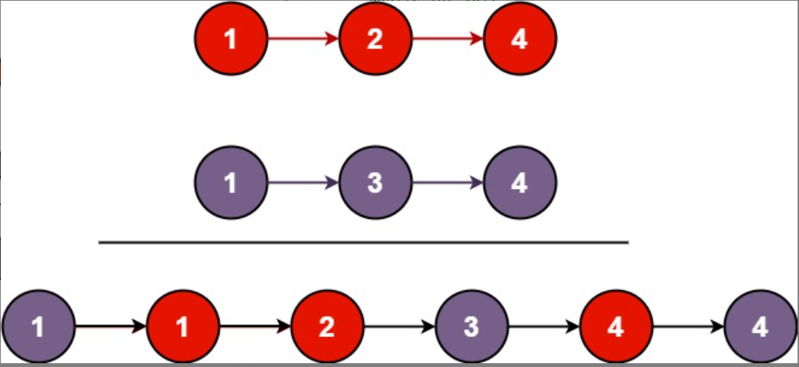

```c#
Input: list1 = [1,2,4], list2 = [1,3,4]
Output: [1,1,2,3,4,4]
```


**Constarints:**

- The number of nodes in both lists is in the range `[0, 50]`.
- Both `list1` and `list2` are sorted in **non-decreasing** order.


<font size=5> 图解过程</font>

#### [递归解法](https://leetcode-cn.com/problems/merge-two-sorted-lists/solution/yi-kan-jiu-hui-yi-xie-jiu-fei-xiang-jie-di-gui-by-/) 一图入魂

- 终止条件：当两个链表都为空时，表示我们对链表已合并完成。

- 如何递归：我们判断 `l1` 和 `l2` 头结点哪个更小，然后较小结点的 `next` 指针指向**其余结点的合并结果。（调用递归）**

  > 为什么较小节点的 `next'指向其余节点的合并结果，没有明白。
  >
  > 因为土木是要求从小到大排序的，所以一定要求最小的排在最前面，因此如果判断到两个链表上的元素，谁最小则就在最前面，其next指针指向下一个次小的；而次小的还未马上检测出来，需要在其余的节点里面再次比较出最小的。


| 1                                                            | 2                                                            |
| ------------------------------------------------------------ | ------------------------------------------------------------ |
| 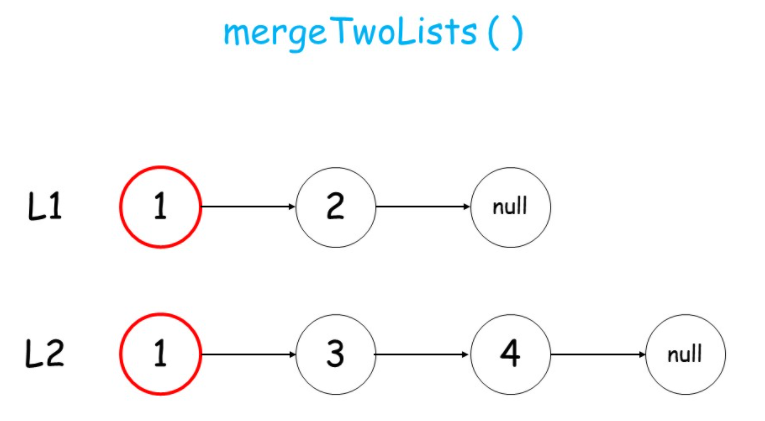 | 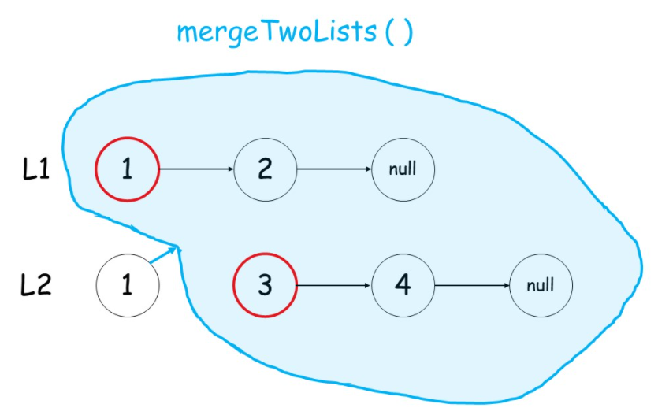 |
| 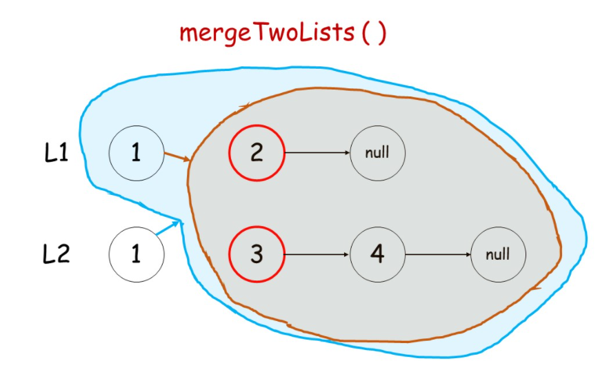 | 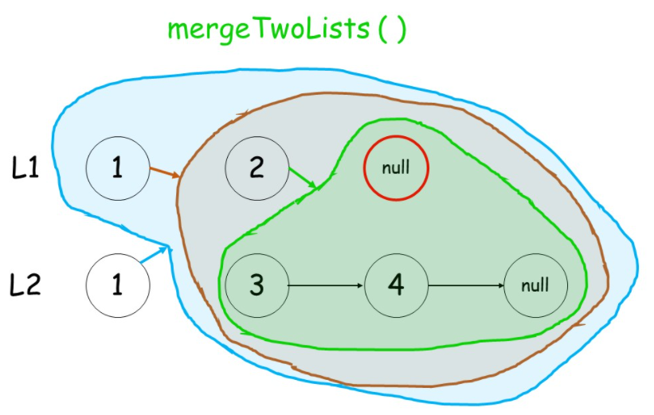 |
| 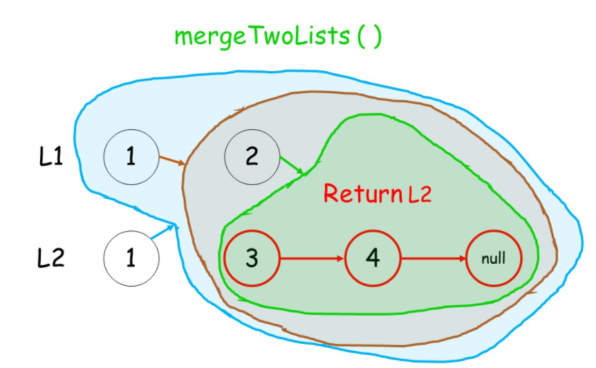 | 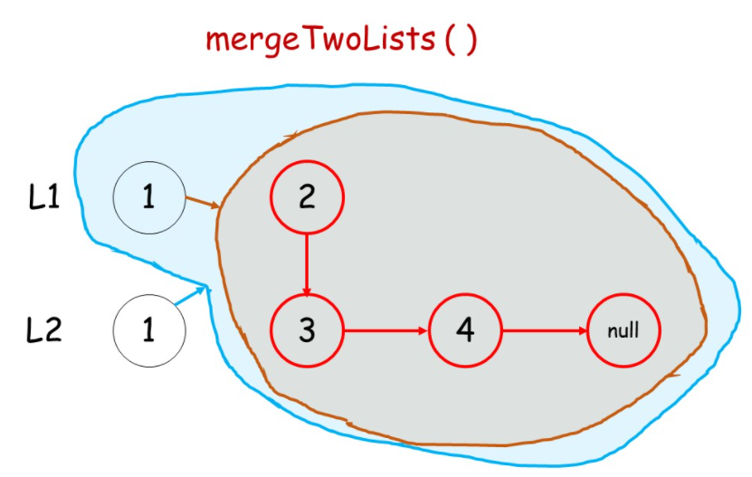 |
| 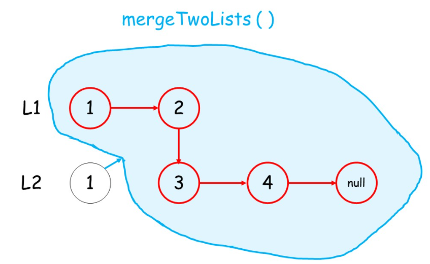 | 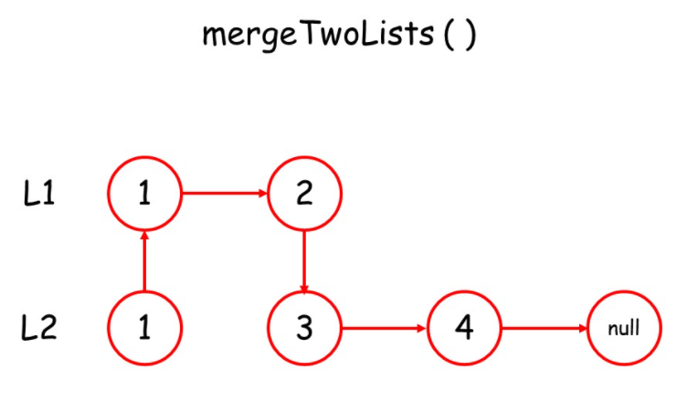 |


**复杂度分析**

 

如何计算递归的时间复杂度和空间复杂度呢？ 力扣对此进行了 详细介绍 ，其中时间复杂度可以这样计算：

给出一个递归算法，其时间复杂度 $O(T)$  通常是递归调用的数量（记作 $R$） 和计算的时间复杂度的乘积（表示为$O(s)$）的乘积：

$O(T)=R*O(s)$


**时间复杂度**：$O(m+n)$

$m$, $n$ 为 $l1$, $l2$ 的元素个数。递归函数每次去掉一个元素，直到两个链表都为空，因此需要调用  $R =  O(m+2)$ 次。而在递归函数中我们只进行了 `next` 指针的赋值操作，复杂度为 $O(1) $, 故递归的总时间复杂度为 $O(T) = R * O(1) = O(m+n)$


**空间复杂度**：$O(m+n)$

对于递归调用 `self.mergeTwoLists()`，当它遇到终止条件准备回溯时，已经递归调用了 $m+n$ 次， 使用了 $m+n$ 个 栈帧 (stack frame),  故最后的空间复杂度为 $O(m+n)$


<font size=5> 参考代码 </font>

```c#
/**
 * Definition for singly-linked list.
 * public class ListNode {
 *     public int val;
 *     public ListNode next;
 *     public ListNode(int val=0, ListNode next=null) {
 *         this.val = val;
 *         this.next = next;
 *     }
 * }
 */
public class Solution {
    public ListNode MergeTwoLists(ListNode list1, ListNode list2) {
        if(list1 ==null){
            return list2;
        }
        if(list2==null){
            return list1;
        }
        if(list1.val<list2.val){
           list1.next =  MergeTwoLists(list1.next,list2);
           return list1;
        } else {
            list2.next = MergeTwoLists(list1,list2.next);
            return list2;
        }
    }
}
```


## 动态规划

