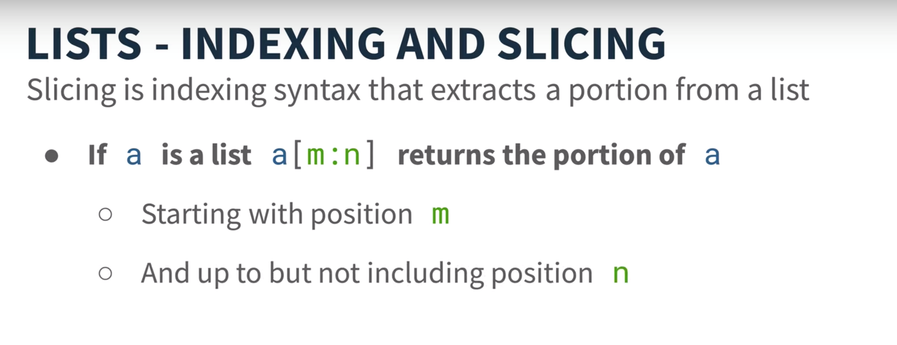
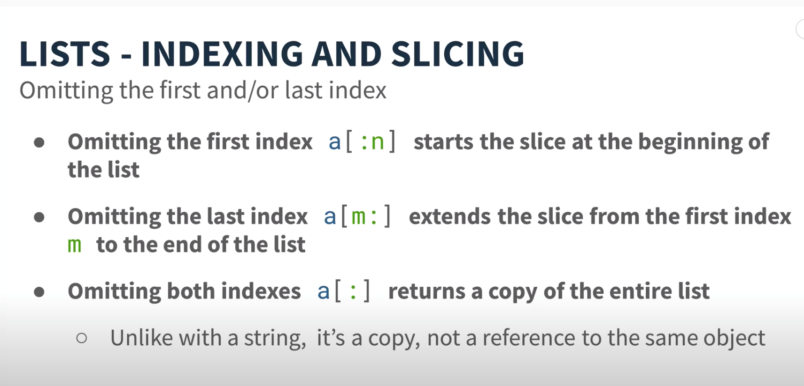
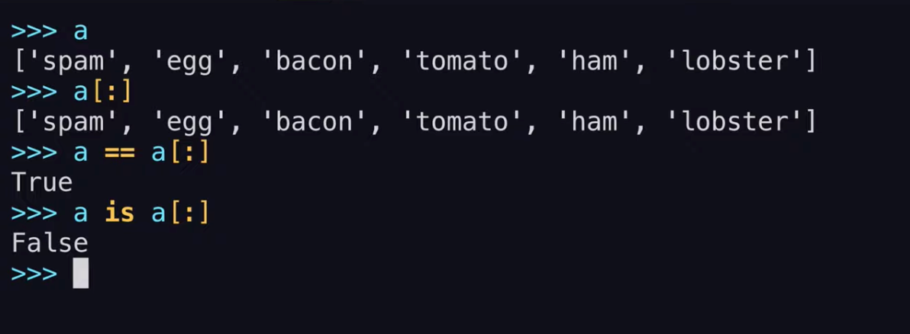
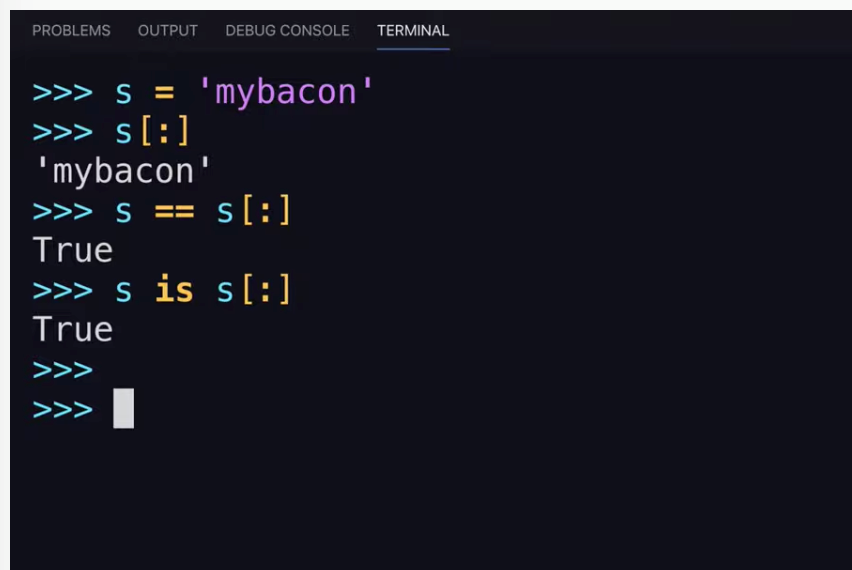
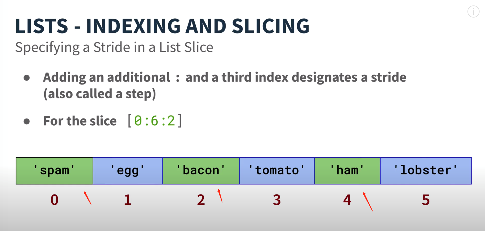
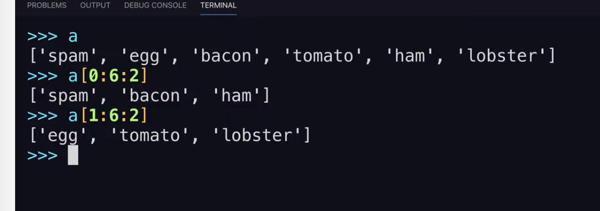
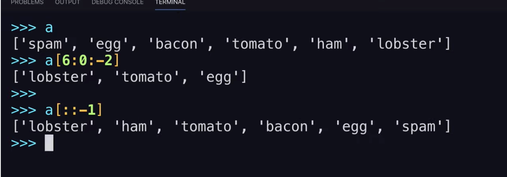
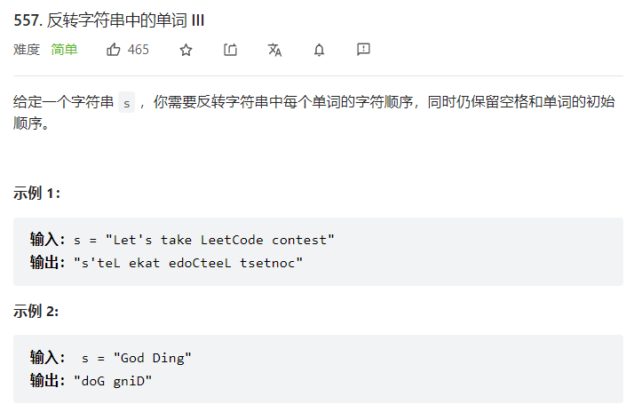

# LeetCode刷题Python基础


[toc]

### 解包/解构

1178\. [Sum of Unique Elements](https://leetcode-cn.com/problems/sum-of-unique-elements/)

You are given an integer array `nums`. The unique elements of an array are the elements that appear **exactly once** in the array.

Return *the **sum** of all the unique elements of* `num`.

**Example 1:**

```c#
Input: nums = [1,2,3,2]
Output: 4
Explanation: The unique elements are [1,3], and the sum is 4.
```


**Code**:

```python
public class Solution {
	def sumOfUnique(self,nums:List[int]) -> int:
    	return sum(num for num, cnt in Counter(nums).items() if cnt ==1 )
}
```


**字典解包（解构）**

```python
public class Solution {
	def sumOfUnique(self,nums:List[int]) -> int:
    	return sum(cnt for cnt in Counter(nums).items() if cnt ==1 )
}
```

num for num 后续没有其他地方引用num了 ，为什么这样写不行呢？


- **这里是字典解包**，是对字典的键进行遍历
- **for key, value in d** 这样就是键值对了


**Reference**

1. [Python: List Comprehensions](https://web.archive.org/web/20180309053826/http://www.secnetix.de/olli/Python/list_comprehensions.hawk)


### 切片

 


 

  


 


 

 


### 字符串操作

[557. 反转字符串中的单词 III](https://leetcode.cn/problems/reverse-words-in-a-string-iii/)

 

```python
class Solution(object):
    def reverseWords(self, s):
        return " ".join(word[::-1] for word in s.split(" "))
```

Python join() 方法用于将序列中的元素以指定的字符连接生成一个新的字符串。

```python
str.join(sequence)

str = "-";
seq = ("a", "b", "c"); # 字符串序列
print str.join( seq );

#输出：
a-b-c
```


#### Join 方法