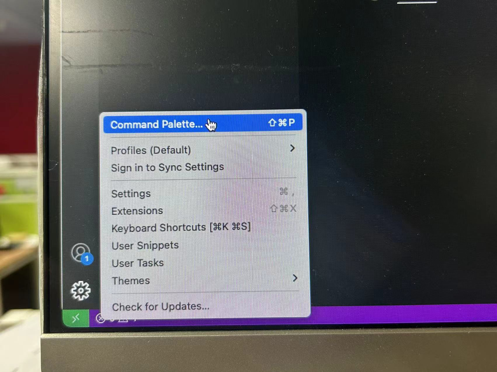
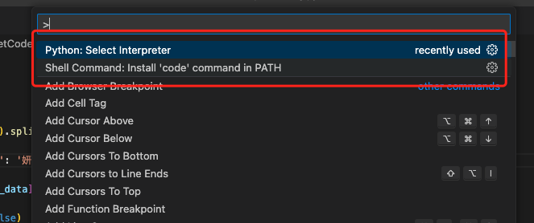
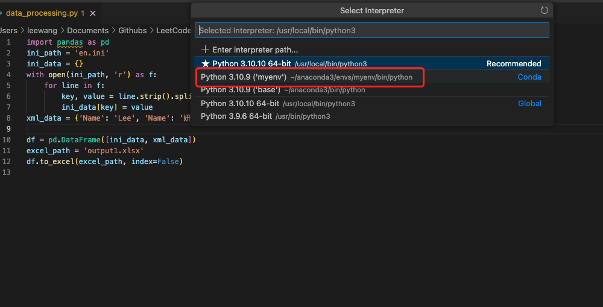

# Python learning

[toc]

## Get Started

### 准备工作：

1. **安装必要的库：** 在VS Code中，你可以使用Anaconda环境来管理你的Python环境和库。首先，打开终端，输入以下命令来创建一个新的Anaconda环境并激活它：

   ```python
   conda create -n myenv python=3.8
   conda activate myenv
   ```

   接下来，安装所需的库，即`pandas`和`openpyxl`。在终端中运行以下命令：

   ```python
   conda install pandas openpyxl
   ```

2. **启动VS Code：** 在终端中输入以下命令来启动VS Code：

   ```python
   code
   ```

#### 读取本地文件数据并转化为Excel：

现在，我们来逐步执行你的初次目标：

#### 步骤1：读取本地文件数据

1. 在VS Code中，创建一个新的Python文件，命名为`data_processing.py`。

2. 导入所需的库：

   ```python
   import pandas as pd
   ```

3. 读取INI文件数据：

   ```python
   ini_path = 'path_to_your_file.ini'
   ini_data = {}
   with open(ini_path, 'r') as f:
       for line in f:
           key, value = line.strip().split('=')
           ini_data[key] = value
   ```

4. 读取XML文件数据（示例）：

   ```python
   xml_data = {'element1': 'value1', 'element2': 'value2'}  # 你可以使用适合的XML库来处理XML文件
   ```

#### 步骤2：将数据写入Excel文件

1. 创建一个Pandas DataFrame：

   ```python
   df = pd.DataFrame([ini_data, xml_data])
   ```

2. 将DataFrame写入Excel文件：

   ```python
   excel_path = 'output.xlsx'
   df.to_excel(excel_path, index=False)
   ```

至此，你已经成功完成了将本地文件数据转化为Excel文件的过程。

#### 调试代码：

在VS Code中，你可以设置断点并使用调试工具来逐步执行代码、观察变量等。以下是如何在VS Code中进行基本调试的步骤：

1. 在Python文件中，点击你想要设置断点的代码行号左侧的空白处。这将在那一行添加一个红色圆点，表示断点已设置。
2. 打开左侧的侧边栏，点击调试图标（类似虫子的图标），然后点击绿色的播放按钮以启动调试。
3. 此时，代码将在第一个断点处暂停。你可以使用调试工具栏上的按钮来逐步执行代码、查看变量等。
4. 如果有多个断点，代码将在每个断点处暂停，直到调试会话结束或你手动中止。

这些步骤应该帮助你在VS Code中进行数据处理并导出为Excel文件的操作。如果你在实际操作中遇到问题，随时向我提问。加油！


## 在VScode中选择正确的环境

> 老是遇到 "ModuleNotFoundError: No module named 'pandas'" 的问题。

原因找到了,在 command palette 中选择正确的环境（**myenv**）再次运行就消除了上述的报错

 


 


 


### 为什么需要创建单独环境

> 我一开始被告知需要创建类似于“Myevn” 环境，就是为了方便管理不同环境下不同的包依赖吗？创建单独环境还有其他好处吗？这点和.NET 上什么技术类似，看起来像docker的技术

是的，创建类似于 `myenv` 这样的虚拟环境的主要目的是为了方便地隔离不同项目或任务之间的包依赖，以及提供一个干净、独立的开发环境。创建单独的环境有许多好处，类似于 `.NET` 上的虚拟环境和容器化技术（如 `Docker`）。

以下是创建虚拟环境的好处：

1. **隔离环境：** 每个虚拟环境都是相互隔离的，这意味着每个环境都可以有自己独立的包依赖和版本，避免了包之间的冲突。
2. **版本控制：** 在不同的项目中，可能需要不同版本的包。通过使用虚拟环境，你可以为每个项目选择特定的包版本，从而确保项目的稳定性。
3. **干净环境：** 虚拟环境提供了一个“干净”的环境，不会受到其他项目或系统环境中已安装的包的干扰。
4. **便携性：** 你可以将虚拟环境轻松地复制到其他计算机上，从而在不同系统之间保持一致的开发环境。
5. **快速清理：** 如果一个虚拟环境不再需要，你可以很容易地删除它，而不会影响其他环境。

这与 `.NET` 上的虚拟环境和容器化技术有些相似。`.NET` 中的虚拟环境（如 `Virtualenv`）以及容器化技术（如 `Docker`）也都旨在提供隔离、独立、干净的开发环境，以及更好的依赖管理。

总而言之，创建单独的虚拟环境是一个良好的实践，可以帮助开发者更有效地管理包依赖、项目开发和环境隔离。


### conda vs pip 

当涉及到 Python 包管理和环境管理时，`conda` 和 `pip` 是两个常用的工具。它们在某些方面相似，但也有一些重要的差异。以下是它们的异同点：

**相似点：**

1. **包管理：** `conda` 和 `pip` 都是用于管理 Python 包的工具，可以用来安装、升级、删除和查询 Python 包。
2. **虚拟环境：** 两者都支持创建虚拟环境，这允许你在项目之间隔离不同的依赖关系，以避免冲突。
3. **开源：** `conda` 和 `pip` 都是开源的，广泛被 Python 社区使用。

**不同点：**

1. **包管理范围：**
   - `conda` 不仅可以管理 Python 包，还可以管理非 Python 的二进制包，这使得它特别适用于科学计算和数据科学环境。
   - `pip` 主要用于管理 Python 包。
2. **环境管理：**
   - `conda` 专注于创建和管理完整的环境，包括安装非 Python 依赖项。这使得 `conda` 在处理跨平台和系统依赖性时更强大。
   - `pip` 也可以用虚拟环境来管理依赖，但它主要关注 Python 包的管理，不会处理系统依赖。
3. **跨平台性：**
   - `conda` 的环境和包管理对于跨平台（如 Windows、Linux、macOS）非常友好，可以确保在不同操作系统上的一致性。
   - `pip` 也可以在多平台上使用，但有时会因为系统依赖而产生问题。
4. **速度：**
   - 一般情况下，`pip` 的速度比 `conda` 更快，特别是在安装纯 Python 包时。
5. **包来源：**
   - `conda` 使用 Anaconda 仓库和第三方仓库（如 conda-forge）作为包的来源。
   - `pip` 使用 PyPI（Python Package Index）作为包的主要来源。

**选择哪个工具：**

- 如果你主要在数据科学、机器学习等领域工作，或者需要处理系统依赖，`conda` 可能更适合你。
- 如果你主要关注纯 Python 的开发，或者你更熟悉使用 PyPI，那么 `pip` 是一个很好的选择。

在实际使用中，很多开发者甚至将两者结合使用，根据需要使用 `conda` 和 `pip` 来管理不同的依赖。无论你选择哪个工具，了解它们的异同可以帮助你更好地管理 Python 开发中的包和环境。


## Reference

1. 使用Python处理数据: https://chat.openai.com/c/9d47c4e0-0547-46f6-917a-cb33c1d9ee98