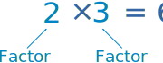
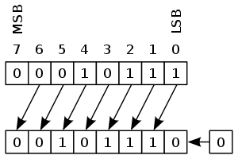
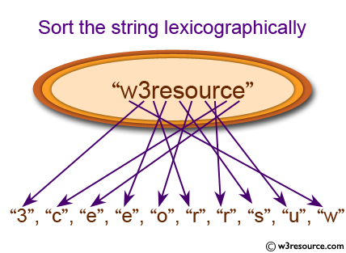

# 常见单词与句子记录.md

[toc]


| 单词                                                         | 解释                                                         |
| ------------------------------------------------------------ | ------------------------------------------------------------ |
| **Substring** <br />**Subsequence**                          | "**`pwwkew`**"：`wke` be a **substring** of `pwwkew`,  whereas "`pwke`" is a **subsequence** and not a substring toward `pwwkew`.<br />**substring**： （字符串的）子串<br />**subsequence**: (字符串的) 子序。<br />这两个概念在《算法图解》9.3讲解动态规划（Dynamic Programming)的时候 |
| **Dynamic Programming**                                      | [Dynamic Programming](https://www.interviewbit.com/courses/programming/topics/dynamic-programming/) (commonly referred to as DP) is an algorithmic technique for solving a problem by **recursively** breaking it down into simpler subproblems and using the fact that the optimal solution to the overall problem depends upon the optimal solution to it’s individual subproblems. |
| **in-place**                                                 | adv： 部署（放置）适当的；就地；原状；在位<br />[In-place algorithm](https://en.wikipedia.org/wiki/In-place_algorithm): In [computer science](https://en.wikipedia.org/wiki/Computer_science), an **in-place algorithm** is an [algorithm](https://en.wikipedia.org/wiki/Algorithm) which transforms input using no auxiliary [data structure](https://en.wikipedia.org/wiki/Data_structure). |
| **permutation**<br />【ˌpɜːrmjuˈteɪʃn】                      | per-完全 + mut-改变 + -ation表名词，***是单词 permute 派生的名词***。<br />**`per-`** <br/>表示“完全，贯穿，自始至终，向前”。forth, ford 是其同源词。<br/>**`mute-`** <br/>= change, 表示“改变、交换”。源自拉丁语 mutare "to change." |
| **[indices](https://leetcode-cn.com/problems/two-sum-ii-input-array-is-sorted/)**<br />【ˈɪndɪsiːz】 | [Indices](https://www.collinsdictionary.com/zh/dictionary/english/index) is a [plural](https://www.collinsdictionary.com/zh/dictionary/english/plural) form of [index](https://www.collinsdictionary.com/zh/dictionary/english/index). |
| **sorted (in)**                                              | **[sorted in non-decreasing order](https://leetcode-cn.com/problems/two-sum-ii-input-array-is-sorted/)**： 按照非递减**排序** |
| **D&C**                                                      | Divide and conquer: 分而治之,一种著名的递归式问题解决方法:<br />1. 找出简单的极限条件；<br />2. 确定如何缩小问题的规模，使其符合基线条件。 |
| **divisor**<br />【dɪˈvaɪzər】                               | A **[divisor](https://leetcode-cn.com/problems/perfect-number/)** of an integer `x` is an integer that can divide `x` evenly.<br />除数;除子<br />***When you [divide](https://dictionary.cambridge.org/zhs/词典/英语-汉语-简体/divide) 21 by 7, 7 is the divisor.*** |
| **factor**                                                   | 因子;因数; a number that divides into another number exactly<br />***1, 2, 3, 4, 6 and 12 are the factors of 12.*** |
| [**prime factor**](https://leetcode-cn.com/problems/ugly-number-ii/) | [质因数](https://www.mathsisfun.com/definitions/prime-factor.html): A factor that is a prime number.<br />In other words: any of the prime numbers that can be multiplied to give the original number.<br />Example: The prime factors of 15 are 3 and 5 (because 3×5=15, and 3 and 5 are prime numbers).<br /> |
| [**prime number**](https://www.mathsisfun.com/definitions/prime-number.html) | prime number**素数**（也叫**质数**），指只能被1和自身整除且大于1的自然数。A whole number above 1 that can **not** be made by multiplying other whole numbers.<br /><br /><br />词根prim与first同源，意思就是最初的、开始的。其应用于数学概念开始于1560年。我们最为熟悉的应该就是primary school小学和prime minister首相；总理这两个例子了。<br />人是primate灵长类动物是因为你我在哺乳动物中first in order。 |
| [perfect number](https://leetcode-cn.com/problems/perfect-number/) | A [perfect number](https://en.wikipedia.org/wiki/Perfect_number) is a positive integer that is equal to the sum of its positive divisors, excluding the number itself. <br />对于一个 **正整数**，如果它和除了它自身以外的所有 **正因子** 之和相等，我们称它为 「完美数」。<br />eg：28 = 1 + 2 + 4 + 7 + 14 <br />1, 2, 4, 7, 和 14 是 28 的所有正因子。那么28是个完美数 |
| [ugly number](https://leetcode-cn.com/problems/ugly-number-ii/) | An ugly number is a positive integer whose **prime factors** are limited to 2, 3, and 5. |
| [Afterward](https://leetcode-cn.com/problems/elimination-game/) | Starting from left to right, remove the first number and every other number **afterward** until you reach the end of the list.<br />从左到右，删除第一个数字，然后**每隔**一个数字删除一个，直到到达列表末尾。<br />f you do something or if something happens **afterward**, you do it or it happens after a particular event or time that has already been mentioned. (某事件、某时间) 之后 |
| **operand**<br />【ˈɑːpərænd】                               | (mathematics) the number on which an operand is to be done. **操作数**；运算数<br /><br />The left-shift operator (<<) shifts its first **operand** left by the number of bits specified by its second **operand**. (左移操作符(<<)将其第一个操作数向左移动其第二个操作数指定的位数。) <br />`<<` 运算符将其左侧操作数向左移动[右侧操作数定义的位数](https://docs.microsoft.com/zh-cn/dotnet/csharp/language-reference/operators/bitwise-and-shift-operators#shift-count-of-the-shift-operators)。<br />eg.`step = step << 2` |
| **left-shift operator**                                      |  |
| [**canonical path**](https://leetcode-cn.com/problems/simplify-path/) | 规范路径 /  标准路径 / 正则路线                              |
| **backtracking**<br />【ˈbæktrækɪŋ】                         | 回溯：<br />1. [Backtracking (Think Like a Programmer)](https://www.youtube.com/watch?v=gBC_Fd8EE8A)<br />2. [The Backtracking Blueprint: The Legendary 3 Keys To Backtracking Algorithms](https://www.youtube.com/watch?v=Zq4upTEaQyM) |
| **[carry](https://leetcode-cn.com/problems/add-two-numbers/solution/liang-shu-xiang-jia-by-leetcode-solution/)**<br />【ˈkæri】 | 进位：to add a number to the next column on the left when adding up numbers, for example when the numbers add up to more than ten. |
| **game theory**                                              | the part of mathematics that deals with situations in which people compete with each other, for example war or business (博弈论；对策论) |
| [lexicographically](https://leetcode.cn/problems/verifying-an-alien-dictionary/) | 字典序;按字典顺序<br /> |
| **lexicography **<br />【ˌleksɪˈkɑːɡrəfi】                   | 词典学;词典编纂;词典编纂学： **Lexicography** is the activity or profession of writing dictionaries.<br /> |
|                                                              |                                                              |

### **backtracking** 【ˈbæktrækɪŋ】（回溯？）

1. If you **backtrack on** a statement or decision you have made, you do or say something that shows that you no longer agree with it or support it. （改变（说法、决定等）；出尔反尔）
   - The committee backtracked by scrapping **[ˈskræpɪŋ]** the controversial bonus system （委员会改变主意，放弃了有争议的奖金制度。）
   - Some backtracking is probably inevitable... （有时改变决定可能是不可避免的。）
   - He promised there would be no backtracking on policies. （他承诺政策不会出尔反尔。）
2. If you **backtrack**, you go back along a path or route you have just used.（ 原路返回）
   - Leonard jumped in his car and started backtracking.（伦纳德跳进车里，开始原路折返。）
3. If you **backtrack** in an account or explanation, you talk about things which happened before the ones you were previously talking about. （ 倒回（描述或解释内容））
   - Can we just backtrack a little bit and look at your primary and secondary education? （我们能不能回过头来谈谈你的小学和中学教育？）


### Lexicographically

今日这道题 [953. Verifying an Alien Dictionary](https://leetcode.cn/problems/verifying-an-alien-dictionary/) 英文描述：

> Given a sequence of `words` written in the alien language, and the order of the alphabet, return `true` if and only if the given `words` are sorted **lexicographically** in this alien language.
>
> 给定一组用外星语书写的单词 `words`，以及其字母表的顺序 `order`，只有当给定的单词在这种外星语中**按字典序排列**时，返回 `true`；否则，返回 `false`。

如果没有写过类似代码，又是第一次阅读到 lexicographically这个单词，可能会一脸茫然。


首先是对这个词的词根相当陌生：

- **lexico- = word, speech, 表示“词汇”{7}**
- **graphy-= write, 表示“写，图”。**源自希腊语 graphein "to scratch, draw, write," gramma "a picture, written letter, piece of writing," grame "a line." {157}

要理解 Lexicographically， 可能要先了解什么是 **Lexicography**.

> Lexicography: 词典学;词典编纂;词典编纂学
>
> **Lexicography** is the activity or profession of writing dictionaries.

由于 **Lexicography** 是表示 编纂字典，那么 **Lexicographical** 就是  *典式的，词典编辑上的* （of or relating to lexicography）

- That's a lexicographical cop out, to say, "miscellaneous technical senses." （用字典编纂学的术语来说，就是“不同的技术时态。”）

那么 再查一下 Lexicographically 就是从 Lexicographical引申出的意思： *字典序;按字典顺序*.

再通过Google找到这篇文章 [Python: Sort a string lexicographically](https://www.w3resource.com/python-exercises/string/python-data-type-string-exercise-22.php)

Write a Python program to sort a string lexicographically.

 

**Python Code:**

```python
def lexicographi_sort(s):
    return sorted(sorted(s), key=str.upper)

print(lexicographi_sort('w3resource'))
print(lexicographi_sort('quickbrown'))
```


**Sample Output:**

```
['3', 'c', 'e', 'e', 'o', 'r', 'r', 's', 'u', 'w']                                                            
['b', 'c', 'i', 'k', 'n', 'o', 'q', 'r', 'u', 'w'] 
```

阅读完就彻底明白什么叫 sort a word lexicographically： 字母按照字典的顺序排列。比如 **`A C F`**就是 **sorted lexicographically**,但是 **`D A F`** 就不是。

