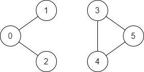

# 广度-深度优先搜索

[toc]


## 733. [Flood fill](https://leetcode-cn.com/problems/flood-fill/)

An image is represented by an `mxn` integer grid `image` where `image[i][j]`represents the pixel value of the image.

You are also given three integers `sr`,`sc`,and `newColor`. You should perform a **flood fill** on the images starting from the pixel `images[sr][sc]`.

To perform a **flood fill**, consider the starting pixel, plus any pixels connected **4-directionally** to those pixels (also with the same color), and so on. Replace the color of all the aforementioned pixels with `newColor`.

Return *the modified image after performing the flood fill.*


```c#
Input: image = [[1,1,1],[1,1,0],[1,0,1]], sr = 1, sc = 1, newColor = 2
    
Output: [[2,2,2],[2,2,0],[2,0,1]]

Explanation: 
From the center of the image with position (sr, sc) = (1, 1) (i.e., the red pixel), all pixels connected by a path of the same color as the starting pixel (i.e., the blue pixels) are colored with the new color.
Note the bottom corner is not colored 2, because it is not 4-directionally connected to the starting pixel.

在图像的正中间，(坐标(sr,sc)=(1,1)), 在路径上所有符合条件的像素点的颜色都被更改成2。注意，右下角的像素没有更改为2，因为它不是在上下左右四个方向上与初始点相连的像素点。
```


<font size=5>参考代码 </font>

```c#
public class Solution {
    int[] dx={1,0,0,-1};
    int[] dy={0,1,-1,0};
    public int[][] FloodFill(int[][] image, int sr, int sc, int newColor) 
    {
        int oldColor = image[sr][sc];
        if(oldColor!=newColor)
        {
            dsf(image,sr,sc,oldColor,newColor);
        }
        return image;
    }

    private void dsf(int[][] image,int r, int c,int oldColor, int newColor)
    {
        if(image[r][c]==oldColor)
        {
            image[r][c] = newColor;
            for(int i = 0; i<4;i++)
            {
                int mr = r + dx[i],mc = c+dy[i];
                if(mr>=0 && mr<image.Length && mc>=0 && mc<image[0].Length)
                {
                    dsf(image,mr,mc,oldColor,newColor);
                }
            }
        }
    }
}
```


<font size=5> 上下左右四个方向的偏移量</font>

问：

```c#
 int[] dx = {1, 0, 0, -1}; 
 int[] dy = {0, 1, -1, 0}; 
```

这两个什么意思啊

答：上下左右四个方向的偏移量；


即便有大佬给出了[答案](https://leetcode-cn.com/problems/flood-fill/solution/tu-xiang-xuan-ran-by-leetcode-solution/)，一时间还是有点难以理解，为什么dx一定是 `{1,0,0,-1}`，而不是 `{1,-1}`呢？

这个需要往回追溯之前更简单的，更易于理解，但是不那么简洁的代码：

```C#
// sr表示 row, sc表示column
public int[][] floodFill(int[][] image, int sr, int sc, int newColor) {
        int oldColor = image[sr][sc];
        if(oldColor == newColor){
            return image;
        }else {
            image[sr][sc] = newColor;
        }
        //存在上
        if(sr - 1 >= 0 && image[sr-1][sc] == oldColor){
            floodFill(image,sr-1,sc,newColor);
        }
        //存在下
        if(sr + 1 < image.length && image[sr+1][sc] == oldColor){
            floodFill(image,sr+1,sc,newColor);
        }
        //存在左
        if(sc - 1 >= 0 && image[sr][sc-1] == oldColor){
            floodFill(image,sr,sc-1,newColor);
        }
        //存在右
        if(sc + 1 < image[sr].length && image[sr][sc+1] == oldColor){
            floodFill(image,sr,sc+1,newColor);
        }
        return image;
    }
```


如上图的一个矩阵所所示：

- image\[0][0]=a;	 image\[0][1]=b; 	image\[0][2]=c;  由此可以看出，移动第二个下标，指针会在a\b\c（同一个row的)三个**column**之间转跳检索;
- image\[0][0]=a;   image\[1][0]=d; image\[2][0]=g;  移动第一个下标，指针会在 a\d\g(同一个column下的)三个不同row之间转跳检索；

**由此可得出结论：**

- 改变第一个下标，则会在上下这个放下检索数据；
- 改变第二个下标，则会在左右这个放下检索数据。

我之前理解困难的原因：

- 移动第二个下标，明明就是改变row的位置嘛， 怎么就是改变column的位置呢?实在是是改变**同一个Row上的不同column**。这样解释是不是更能帮助自己理解？

- 有时候初学者的思维就会卡在这里面，会强烈的认为事情A是B，这时候需要反复阅读、抄写，画图理解则显得尤为重要。通过学这些算法，能深刻帮助理解孩子在学习过程中的思维以及如何引导。


## 617. [Merge two binary trees](https://leetcode-cn.com/problems/merge-two-binary-trees/)

You are given two binary trees `root1` and `root2`.

Imagine that when you put one of them to cover the other, some nodes of the two trees are overlapped while the others are not. You need to merge the two trees into a new binary tree. The merge rule is that if two nodes overlap, then sum node values up as the new value of the merged node. Otherwise, the NOT null node will be used as the node of the new tree.

Return *the merged tree*.

**Note:** The merging process must start from the root nodes of both trees.

示例 1:

```c#
输入: 
	Tree 1                     Tree 2                  
          1                         2                             
         / \                       / \                            
        3   2                     1   3                        
       /                           \   \                      
      5                             4   7                  
输出: 
合并后的树:
	     3
	    / \
	   4   5
	  / \   \ 
	 5   4   7
```


<font size=5> 参考代码  </font>

```c#
/**
 * Definition for a binary tree node.
 * public class TreeNode {
 *     public int val;
 *     public TreeNode left;
 *     public TreeNode right;
 *     public TreeNode(int val=0, TreeNode left=null, TreeNode right=null) {
 *         this.val = val;
 *         this.left = left;
 *         this.right = right;
 *     }
 * }
 */
class Solution {
	public TreeNode mergeTrees(TreeNode t1, TreeNode t2) {
		if(t1==null || t2==null) {
			return t1==null? t2 : t1;
		}
		return dfs(t1,t2);
	}
	
	TreeNode dfs(TreeNode r1, TreeNode r2) {
		// 如果 r1和r2中，只要有一个是null，函数就直接返回
		if(r1==null || r2==null) {
			return r1==null? r2 : r1;
		}
		//让r1的值 等于  r1和r2的值累加，再递归的计算两颗树的左节点、右节点
		r1.val += r2.val;
		r1.left = dfs(r1.left,r2.left);
		r1.right = dfs(r1.right,r2.right);
		return r1;
	}
}

作者：wang_ni_ma
链接：https://leetcode-cn.com/problems/merge-two-binary-trees/solution/dong-hua-yan-shi-di-gui-die-dai-617he-bing-er-cha-/
来源：力扣（LeetCode）
著作权归作者所有。商业转载请联系作者获得授权，非商业转载请注明出处。
```


可以进一步简化为：

```c#
/**
 * Definition for a binary tree node.
 * public class TreeNode {
 *     public int val;
 *     public TreeNode left;
 *     public TreeNode right;
 *     public TreeNode(int val=0, TreeNode left=null, TreeNode right=null) {
 *         this.val = val;
 *         this.left = left;
 *         this.right = right;
 *     }
 * }
 */
public class Solution {
    public TreeNode MergeTrees(TreeNode root1, TreeNode root2) {
        if(root1 ==null)
        {
            return root2;
        }
        if(root2 ==null)
        {
            return root1;
        }
        TreeNode merged = new TreeNode(root1.val + root2.val);
        merged.left = MergeTrees(root1.left,root2.left);
        merged.right = MergeTrees(root1.right,root2.right);
        return merged;
    }
}
```


## [1971. 寻找图中是否存在路径](https://leetcode.cn/problems/find-if-path-exists-in-graph/)

**Find if Path Exists in Graph：**

There is a **bi-directional** graph with `n` vertices, where each vertex is labeled from `0` to `n - 1` (inclusive). 

> 有一个具有 `n` 个顶点的 **双向** 图，其中每个顶点标记从 `0` 到 `n - 1`（包含 `0` 和 `n - 1`）。

The edges in the graph are represented as a 2D integer array `edges`, where each `edges[i] = [ui, vi]` denotes a bi-directional edge between vertex `ui` and vertex `vi`.

> 图中的边用一个二维整数数组 `edges` 表示，其中 `edges[i] = [ui, vi]` 表示顶点 `ui` 和顶点 `vi` 之间的双向边。

Every vertex pair is connected by **at most one edge**, and no vertex has an edge to itself. 

> 每个顶点对由 **最多一条** 边连接，并且没有顶点存在与自身相连的边。

You want to determine if there is a **valid path** that exists from vertex `source` to vertex `destination`.

> 请你确定是否存在从顶点 `source` 开始，到顶点 `destination` 结束的 **有效路径** 。


Given `edges` and the integer `n`, `source`, and `destination`, return `true` *if there is a **valid path** from `source` to `destination`, or `false` otherwise*. 

> 给你数组 edges 和整数 n、source 和 destination，如果从 source 到 destination 存在 有效路径 ，则返回 true，否则返回 false 。
>

**示例 1：**

  

```ABAP
输入：n = 3, edges = [[0,1],[1,2],[2,0]], source = 0, destination = 2
输出：true
解释：存在由顶点 0 到顶点 2 的路径:
- 0 → 1 → 2 
- 0 → 2
```


**示例 2：**

  

```ABAP
输入：n = 6, edges = [[0,1],[0,2],[3,5],[5,4],[4,3]], source = 0, destination = 5
输出：false
解释：不存在由顶点 0 到顶点 5 的路径.
```


**解题+评注**：

```C#
public class Solution {
    public bool ValidPath(int n, int[][] edges, int source, int destination) {
        IList<int>[] adj =  new IList<int>[n];
        for (int i = 0; i < n ; i++){
            adj[i] = new List<int>();
        }

        foreach(int[] edge in edges){
            int x = edge[0], y = edge[1]; // edge => [0, 1]
            adj[x].Add(y); //顶点 0 指向 顶点 1 （每个顶点允许指向 N 个其他订单，因此要用array来表示这种结构）
            adj[y].Add(x); // 顶点 1 指向 顶点 0 
            //最终输出结构(例1)：adj[0]=[1,2] ; adj[1] = [0,1]; adj[2]= [0,1]
        }

        /*建立一个boolean数组，用来指示哪些vertex顶点可以被达到访问*/
        bool[] visited =  new bool[n];

        Queue<int> queque = new Queue<int>();
        queque.Enqueue(source);
        visited[source] = true;

        while(queque.Count > 0){
            int vertex = queque.Dequeue();
            if(vertex == destination){
                //如果当前的顶点刚好等于目标的顶点，说明是可以被返回到，则跳出loop，
                //并且把 visisted[destination]返回去
                break;
            }
            foreach(int next in adj[vertex]){ // 前面第二段代码，已经把 adj[vertex]所有的临近vertext都加入到该数组里面了
                // (例1)：adj[0]=[1,2] ; adj[1] = [0,1]; adj[2]= [0,1]
                if(!visited[next]){

                    queque.Enqueue(next); //这里把临近vertext订单都入到队列里面，如果是0,则这里入列的有1,2
                    visited[next] = true;//同时把visited[1], visited[2]都设置为可以到达
                }
            }
        }
        return visited[destination];
    }
}
```

