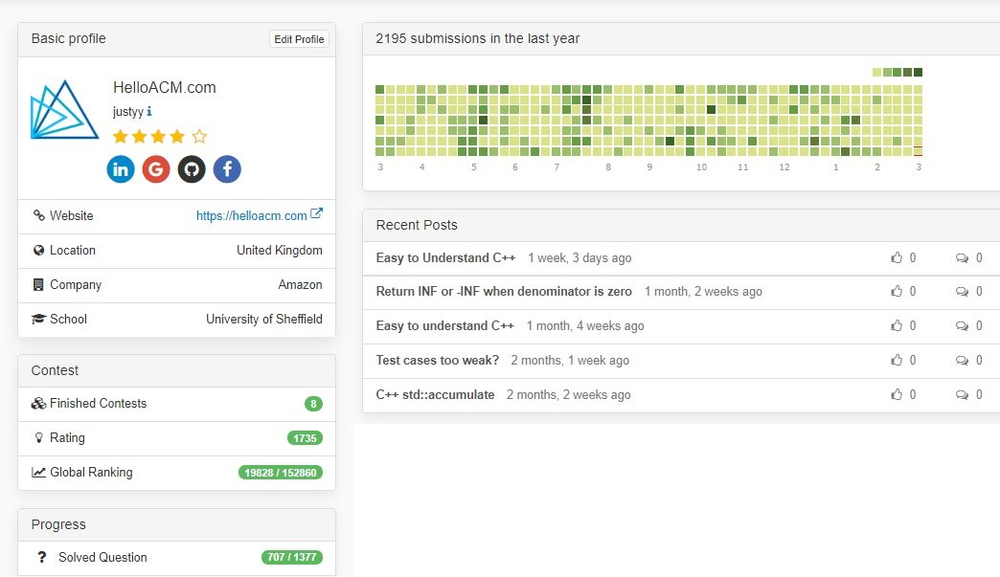
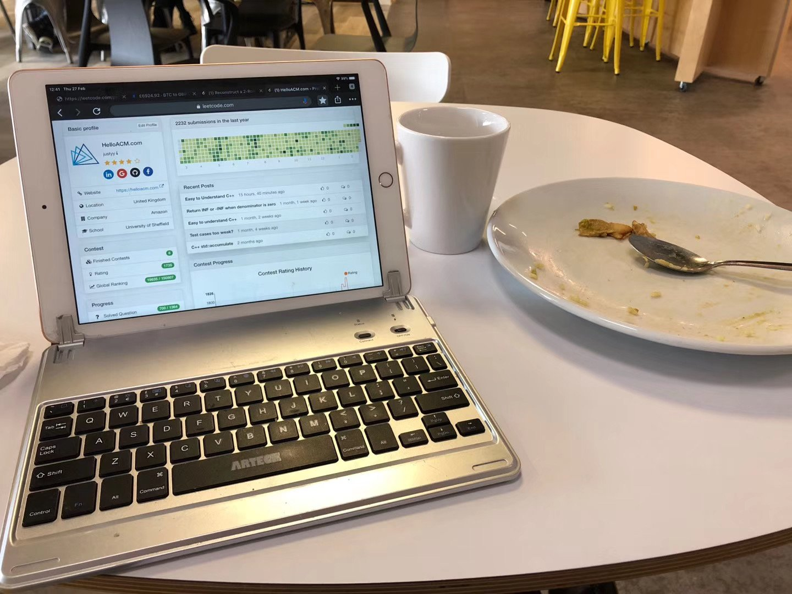
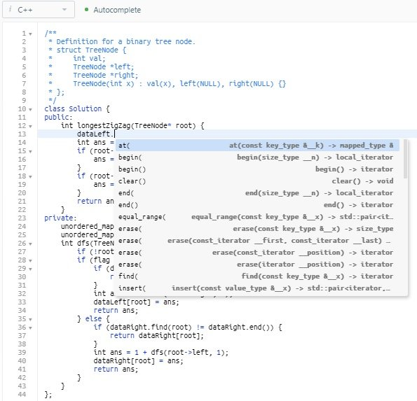

# 时间碎片用来刷题是再好不过的了

[toc]

今天, 成功的在 leetcode 上打卡一年, 一共707题 (我的 [leetcode 主页](https://leetcode.com/justyy)).

leetcode-one-year

这一年大概刷了400多道题, 基本上都是碎片时间刷的:

- 上班午休的时候边吃饭边看题[刷题](https://justyy.com/archives/31192)
- 周末带孩子去 soft play 喝咖啡刷一题. 不成文的规定: 一杯Latte来一题
- 把媳妇的车开到洗车的地方 然后等待的时候到旁边的 Costa 来一题
- 周末早上吃早餐的时候来一题

这些都是比较连续的时间, 当然很多情况下刚打开题目看了几分钟就有事被叫走了, 不过这也不是坏事, 有时候等公交的时候也可以想想刚刚那题的思路, 等有时间了再打开 iPad 写代码的时候就很快了.

有一次在公司用微波炉热饭期间就刷完了 – Accepted.

ipad-with-bluetooth-keyboard

刷题的装备也较简单: iPad 2019 和 蓝牙键盘. 现在的 Leetcode 不得了, 在浏览器里就可以跑代码, 下断点跟踪调试. 甚至还有代码提示补全功能, 已经算得上一个在线的IDE了.

leetcode-auto-code-completion

iPad 没有数据流量怎么办? 我的手机套餐是每月30 GB流量, 在没有WIFI的情况下开一下手机热点 (hot spot), 不是问题, 非常好用. 当然我还是会随身带个充电宝, 因为开热点后手机电量消耗得飞快.

Leetcode 我年年都有买会员, 一年160美元, 很值. Preimium 会员的好处: 提交代码判定较快, [代码调试](https://justyy.com/archives/31427), 还有就是可以刷所有的题, 还有做一些面试的 Mock 仿真练习.

代码调试在平板上还是很重要的, 特别是对于难度中等和偏难的题, 还有就是代码量较多的时候, 往往代码出错需要调试一下才能发现问题. 没有调试只能用眼看, 有时候摸不着头脑(特别是没法 console.log输出变量到控制台). 平板上没有很好用的代码IDE, 不得不说, leetcode这一点做得很出色.

我现在刷题就是个爱好, 习惯成自然了, 刷题给了我写英文[算法博客](https://helloacm.com/)的素材, 刷一遍, 过几天再回顾, 然后写成博文, 锻炼英文语言写作组织能力, 并且又再学习一次算法.

每天不一定要[刷一题](https://justyy.com/archives/6471)新的, 可以是你自己刷过的, 换种语言刷刷? 换种思路试试? 然后就是看看别人是怎么做的. 这些都能让你进步.

## Reference 

1. [时间碎片用来刷题是再好不过的了](https://justyy.com/archives/32015)