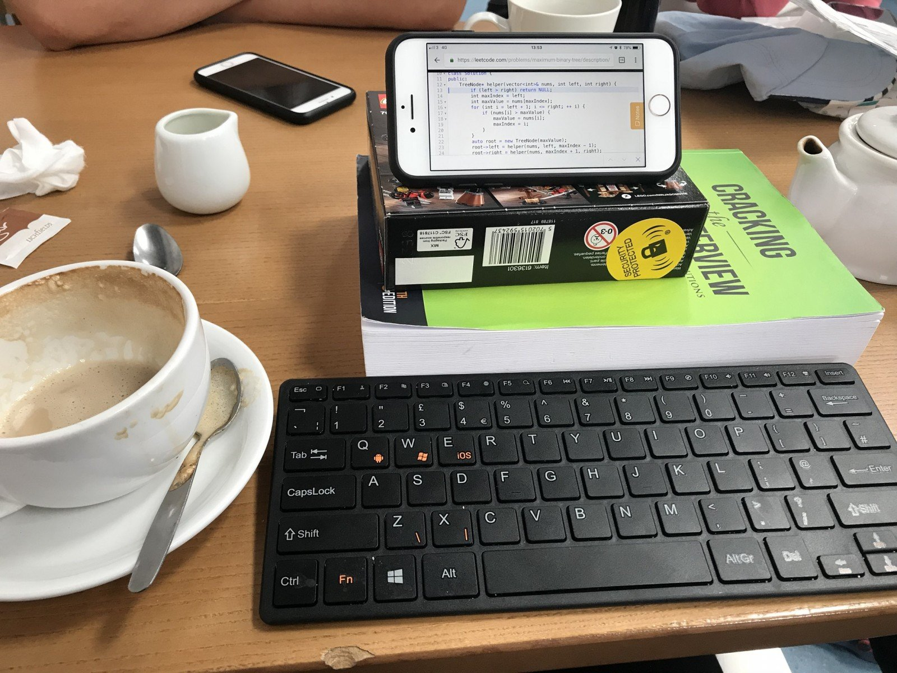

# 程序员能刷题的网站和资源(我的刷题经验之谈)

[toc]

程序员提高技能的最好的方法就是[刷题](https://justyy.com/archives/6471), 俗话说得好: 刷刷更健康. 这几年我刷了不少题, 比直接看枯燥的算法书效率高得很多.

刷题也有方法. 我的方法是先独立思考, 先自己解题, 即使解出来了, 也要再看一下题解和别人的思路. 最好还要看一下牛人的代码, 看看他们是怎么实现的.

当然, 最重要的是要总结, 写下来就是一个不错的再思考再学习的过程, 我就很喜欢解题后用英文写成博文, 这样有几个好处:

-  一是解了多少题可以方便统计,
- 二是可以分享,
- 三是可以挣广告费.

不一定通过了就马上总结, 可以有时间的时候再回顾写一下, 方便于记忆学习. 有些题你过了几个月, 你解题思路就可能忘记了, 甚至你都不记得你做过这题了, 那么这种情况下就是没有学习彻底.

刷题刷多了, 一定会学到思路, 解题方法, 思考方法, 即使[面试](https://justyy.com/archives/18985)的时候给出一道你完全没见过的题, 稍加思考你就能迎刃而解了.

### 刷题资源: ONLINE JUDGE

以下是我用过的些刷题网站:

- [Leetcode.com](http://leetcode.com/) 或中文版 [leetcode-cn.com](http://leetcode-cn.com/): 这个是很经典, 推荐买会员解锁所有的题, 会员还有其它好用的功能, 比如 模拟Mock测试, 优先判别等. 力扣上还有分知识点学习, 是个很不错的综合学习网站. 我比较喜欢力扣是因为题目的解题只需要编写算法的部分, 给了函数的接口, 不需要关心I/O输入和输出. 每周都有比赛, 每两周有双周赛, 可惜很经常时间不合适, 对于欧洲时区, 每周的比赛在周日的凌晨.
- [http://acm.timus.ru](http://acm.timus.ru/) 这个是老毛子的经典 online judge, 题目较难, 很锻炼英文和理解能力, 测试用例较难. 有定期举行在线比赛.
- [hackerrank.com](http://hackerrank.com/) 这个是印度人搞的, 没怎么用过, 他们的浏览器里的代码编辑功能是带代码提示和自动完成的, 这是一大亮点. 在上面刷完题还可以顺便投简历. 也有定期比赛
- [newcoder.com](http://newcoder.com/) 中国的牛客网, 题目很多, 不仅仅是刷题, 还有计算机方方面面的选择题. 解题是没有模板, 得从零开始编写 int main() 处理输入
- [codeforces.com](http://codeforces.com/) 也是老毛搞的, 题目较多, 定期有比赛, 不过不喜欢他们家的界面, 看着有点累.
- [spoj.com](http://spoj.com/) 题目也很多, 支持的语言很很多. 但该网站上有放广告.
- [lintcode.com](http://lintcode.com/) 中国人的, 好像是九章. 没怎么用过
- [http://scriptoj.mangojuice.top](http://scriptoj.mangojuice.top/) 前端 Javascript
- Google [Kickstart](https://justyy.com/archives/44896): 谷歌的这个程序员竞赛从2013年就有了, 很多大神程序员都在上面刷比赛
- [BinarySearch.com](http://binarysearch.com/) 这个网站最近发现的, 挺不错的, 界面友好, 也有周赛

还有其它不是专门做 Online Judge 但是可以免费刷几题的:

- [https://www.testdome.com](https://www.testdome.com/) 公司可以用来筛选候选人, 而求职者可以测评自己的编程能力: C++, PHP, Java 等都有. 通过测试还会有[电子证书](https://www.testdome.com/cert/ebec865987b04b35bb984fb95a0738ff), 可以放在 Linkedin 上.
- [https://algoexpert.io](https://algoexpert.io/) 可以刷几题免费的
- [hired.co.uk](https://justyy.com/out/hired) 和 [triplebyte](https://justyy.com/out/triplebyte) 可以刷几题简单免费的, 找工作用的. [现在的求职网站越做越细致](https://justyy.com/archives/19070)

我在力扣上刷了900题左右, 在 ACM.timus.ru 刷了300多题 (http://acm.timus.ru/author.aspx?id=46914), 这是我主要刷的两个地方.

最近也在刷 [Leetcode 中](https://leetcode-cn.com/justyyuk) (还有[英文LC](https://leetcode.com/justyy/))两版的每日一题.

还有就是, 使用leetcode刷题可以完全脱离ide([平板+蓝牙键盘](https://justyy.com/archives/6471)), 而脱离IDE写代码对速度提升有很大帮助的.

PS: 最近还发现一个比较另类的刷题网站: https://projecteuler.net/ 就是数学题, 填空, 当然一般情况下你需要借助代码来获得答案. 比如这题:

获取小于[4百万的偶斐波那契数列](https://helloacm.com/sum-of-even-fibonacci-numbers/)的和.

现在一共刷了:

更新:
又发现了一个可以刷题的网站, 偏向找工作用的: https://coderbyte.com/profile/justyy

#### 我的常用的刷题资源

- https://binarysearch.com/@/justyy
-  http://leetcode.com/justyy
-  http://leetcode-cn.com/u/justyyuk
-  https://acm.timus.ru/author.aspx?id=46914
-  https://codeforces.com/profile/DoctorLai
-  https://projecteuler.net/progress=justyy

祝你面试成功!

## Reference

1. [程序员能刷题的网站和资源(我的刷题经验之谈)](https://justyy.com/archives/31192)